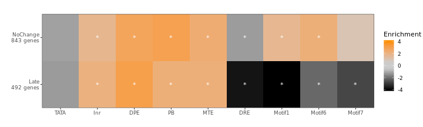
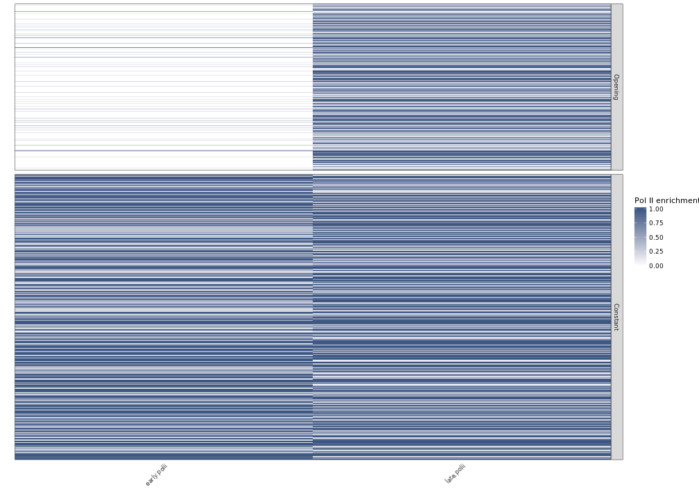
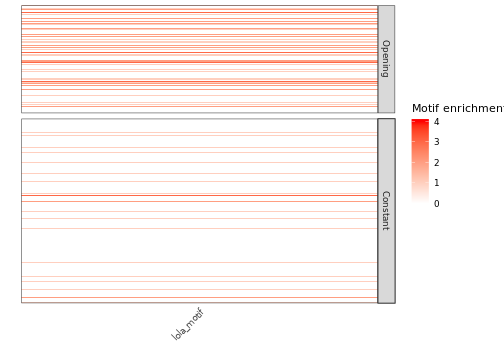

# Calculating Pol II enrichments


**Project:** Promoter Opening

**Author:** [Vivek](mailto:vir@stowers.org)

**Generated:** Tue Nov 26 2019, 01:41 AM

## Samples overview

We will calculate the pol II enrichments for the following samples

-----------------------------------------------------------------------------------------------------------------------
  label    factor   window_upstream   window_downstream                ip                             wce              
--------- -------- ----------------- ------------------- ------------------------------- ------------------------------
 early_1   polii           0                 200           Dme_emb_2-4h_Rpb3_1_rpm.bw      Dme_emb_2-4h_WCE_1_rpm.bw   

 early_2   polii           0                 200          Dme_emb_2-4h_Rpb3_2_R2_rpm.bw   Dme_emb_2-4h_WCE_2_R2_rpm.bw 

 late_1    polii           0                 200          Dme_emb_14-17h_Rpb3_1_rpm.bw    Dme_emb_14-17h_WCE_1_rpm.bw  

 late_2    polii           0                 200          Dme_emb_14-17h_Rpb3_2_rpm.bw    Dme_emb_14-17h_WCE_2_rpm.bw  

 late_3    polii           0                 200          Dme_emb_14-17h_Rpb3_3_rpm.bw    Dme_emb_14-17h_WCE_3_rpm.bw  
-----------------------------------------------------------------------------------------------------------------------

## load the samples


## Calculate enrichments

Before calculating enrichment, we floor the WCE signal for each region at the median WCE signal level among all transcripts.


## Save results


#different groups


## Promoter element heatmap




## GO terms


### Late genes

See full spreadsheet in folder `figure1b_enrichments/`

       GOBPID       Pvalue OddsRatio   ExpCount Count Size
1  GO:0099537 3.411945e-11  4.272077   9.666214    35  291
2  GO:0023052 1.371198e-10  3.223888  17.529110    48  579
3  GO:0007154 5.645948e-10  3.036641  18.891476    49  624
4  GO:0065007 8.067823e-10  1.878277 140.110271   198 4218
5  GO:0007267 1.197224e-08  3.004838  15.545663    41  468
6  GO:0042391 4.437687e-07  6.177563   2.723813    14   82
7  GO:0006813 1.249315e-06  7.632007   1.793730    11   54
8  GO:0071805 1.643690e-06  8.507687   1.494775    10   45
9  GO:0051716 1.832689e-06  1.916345  46.374835    78 1438
10 GO:0007186 2.950422e-06  4.785087   3.613907    15  113
11 GO:0006836 4.210067e-06  4.126100   4.683629    17  141
12 GO:0007187 1.828697e-05  6.196413   1.926599    10   58
13 GO:0006812 2.050059e-05  8.280112   1.208188     8   38
15 GO:0055085 4.333173e-05  2.118167  20.627899    40  621
16 GO:0007274 5.600142e-05  4.815480   2.624161    11   79
                                                                                          Term
1                                                                     trans-synaptic signaling
2                                                                                    signaling
3                                                                           cell communication
4                                                                        biological regulation
5                                                                          cell-cell signaling
6                                                             regulation of membrane potential
7                                                                      potassium ion transport
8                                                        potassium ion transmembrane transport
9                                                                cellular response to stimulus
10                                                G protein-coupled receptor signaling pathway
11                                                                  neurotransmitter transport
12 G protein-coupled receptor signaling pathway, coupled to cyclic nucleotide second messenger
13                                                                            cation transport
15                                                                     transmembrane transport
16                                                         neuromuscular synaptic transmission


### No change genes

See full spreadsheet in folder

       GOBPID       Pvalue OddsRatio  ExpCount Count Size
1  GO:0009888 3.569556e-60  5.403244  55.23882   194  904
2  GO:0009887 1.039385e-57  6.485417  36.70605   154  602
3  GO:0002009 3.880267e-53  7.041193  28.80323   131  463
4  GO:0035239 1.078066e-50  6.931990  27.88917   126  442
5  GO:0002165 2.400664e-49  5.980185  34.59771   139  542
6  GO:0022008 6.654818e-49  6.051892  33.43552   136  569
7  GO:0048569 1.073135e-48  6.970757  26.30802   120  416
8  GO:0032501 1.373159e-46  3.694646 119.85399   268 2228
9  GO:0035107 1.161819e-45  7.674311  21.07434   104  329
10 GO:0048737 1.351163e-44  7.704539  20.32999   101  320
11 GO:0030182 3.558180e-41  6.243019  25.43483   109  431
12 GO:0007560 9.289646e-40  7.062303  20.12023    95  323
13 GO:0000904 1.144106e-37  5.507334  28.54803   111  449
14 GO:0032990 1.689723e-37  5.428953  29.14536   112  455
15 GO:0120039 4.241100e-37  5.463282  28.44074   110  444
                                                    Term
1                                     tissue development
2                             animal organ morphogenesis
3                         morphogenesis of an epithelium
4                                     tube morphogenesis
5                     instar larval or pupal development
6                                           neurogenesis
7                post-embryonic animal organ development
8                       multicellular organismal process
9                                appendage morphogenesis
10           imaginal disc-derived appendage development
11                                neuron differentiation
12                           imaginal disc morphogenesis
13        cell morphogenesis involved in differentiation
14                               cell part morphogenesis
15 plasma membrane bounded cell projection morphogenesis
## Normalize for heatmap


## Pol II heatmap early late




```
## 
## 	Pairwise comparisons using Wilcoxon rank sum test 
## 
## data:  promoter.df$lola_motif and promoter.df$change 
## 
##         Constant
## Opening <2e-16  
## 
## P value adjustment method: hochberg
```




## Session information

For reproducibility, this analysis was performed with the following R/Bioconductor session:


```
R version 3.6.1 (2019-07-05)
Platform: x86_64-pc-linux-gnu (64-bit)
Running under: Ubuntu 18.04.2 LTS

Matrix products: default
BLAS:   /usr/lib/x86_64-linux-gnu/blas/libblas.so.3.7.1
LAPACK: /usr/lib/x86_64-linux-gnu/lapack/liblapack.so.3.7.1

locale:
 [1] LC_CTYPE=C.UTF-8       LC_NUMERIC=C           LC_TIME=C.UTF-8       
 [4] LC_COLLATE=C.UTF-8     LC_MONETARY=C.UTF-8    LC_MESSAGES=C.UTF-8   
 [7] LC_PAPER=C.UTF-8       LC_NAME=C              LC_ADDRESS=C          
[10] LC_TELEPHONE=C         LC_MEASUREMENT=C.UTF-8 LC_IDENTIFICATION=C   

attached base packages:
[1] stats4    parallel  stats     graphics  grDevices utils     datasets 
[8] methods   base     

other attached packages:
 [1] GO.db_3.8.2                           scales_1.0.0                         
 [3] BSgenome.Dmelanogaster.UCSC.dm6_1.4.1 BSgenome_1.52.0                      
 [5] Biostrings_2.52.0                     XVector_0.24.0                       
 [7] rtracklayer_1.44.4                    GenomicRanges_1.36.1                 
 [9] GenomeInfoDb_1.20.0                   org.Dm.eg.db_3.8.2                   
[11] GOstats_2.50.0                        graph_1.62.0                         
[13] Category_2.50.0                       Matrix_1.2-17                        
[15] AnnotationDbi_1.46.1                  IRanges_2.18.2                       
[17] S4Vectors_0.22.1                      Biobase_2.44.0                       
[19] BiocGenerics_0.30.0                   matrixStats_0.55.0                   
[21] reshape2_1.4.3                        ggplot2_3.2.1                        
[23] xtable_1.8-4                          pander_0.6.3                         
[25] magrittr_1.5                          tidyr_1.0.0                          
[27] dplyr_0.8.3                           cowplot_1.0.0                        
[29] knitr_1.24                           

loaded via a namespace (and not attached):
 [1] bit64_0.9-7                 splines_3.6.1              
 [3] assertthat_0.2.1            highr_0.8                  
 [5] RBGL_1.60.0                 blob_1.2.0                 
 [7] GenomeInfoDbData_1.2.1      Rsamtools_2.0.0            
 [9] pillar_1.4.2                RSQLite_2.1.2              
[11] backports_1.1.4             lattice_0.20-38            
[13] glue_1.3.1                  digest_0.6.20              
[15] colorspace_1.4-1            plyr_1.8.4                 
[17] GSEABase_1.46.0             XML_3.98-1.20              
[19] pkgconfig_2.0.2             genefilter_1.66.0          
[21] zlibbioc_1.30.0             purrr_0.3.2                
[23] BiocParallel_1.18.1         tibble_2.1.3               
[25] annotate_1.62.0             ellipsis_0.2.0.1           
[27] withr_2.1.2                 SummarizedExperiment_1.14.1
[29] lazyeval_0.2.2              survival_2.44-1.1          
[31] crayon_1.3.4                memoise_1.1.0              
[33] evaluate_0.14               tools_3.6.1                
[35] lifecycle_0.1.0             stringr_1.4.0              
[37] munsell_0.5.0               DelayedArray_0.10.0        
[39] compiler_3.6.1              rlang_0.4.0                
[41] grid_3.6.1                  RCurl_1.95-4.12            
[43] AnnotationForge_1.26.0      labeling_0.3               
[45] bitops_1.0-6                gtable_0.3.0               
[47] DBI_1.0.0                   R6_2.4.0                   
[49] GenomicAlignments_1.20.1    bit_1.1-14                 
[51] zeallot_0.1.0               Rgraphviz_2.28.0           
[53] stringi_1.4.3               Rcpp_1.0.2                 
[55] vctrs_0.2.0                 tidyselect_0.2.5           
[57] xfun_0.9                   
```
