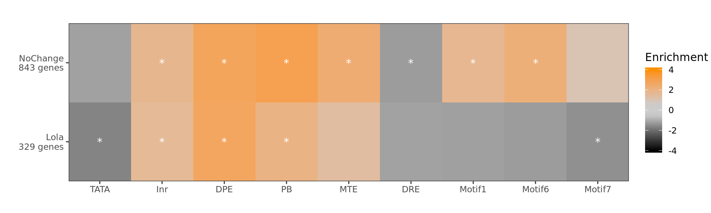

# Calculating Lola binding at Late promoters


**Project:** Promoter Opening

**Author:** [Vivek](mailto:vir@stowers.org)

**Generated:** Tue Nov 26 2019, 02:10 AM


```
##   Location Frequency
## 1   distal 0.3953988
## 2 promoter 0.6046012
```

```
##     Motif Frequency
## 1  absent 0.2121874
## 2 present 0.7878126
```

```
## Warning in .Seqinfo.mergexy(x, y): Each of the 2 combined objects has sequence levels not in the other:
##   - in 'x': chrM, chrX_DS484099v1_random, chrX_DS484216v1_random, chrY_DS485329v1_random
##   - in 'y': chrUn_DS483562v1, chrUn_DS484160v1, chrUn_DS484280v1, chrX_DS484953v1_random
##   Make sure to always combine/compare objects based on the same reference
##   genome (use suppressWarnings() to suppress this warning).
```

```
## GRanges object with 373 ranges and 7 metadata columns:
##         seqnames    ranges strand |                     name      score
##            <Rle> <IRanges>  <Rle> |              <character>  <numeric>
##     [1]    chr3R  10100743      * | lola_i_peaks_1_peak_1183  3950.8147
##     [2]     chrX  13563645      * | lola_i_peaks_1_peak_1653 2978.07568
##     [3]    chr3R  26261636      * | lola_i_peaks_1_peak_1418 2608.04272
##     [4]    chr2L  12974258      * |  lola_i_peaks_1_peak_205 2173.13135
##     [5]    chr3L  18801513      * | lola_i_peaks_1_peak_1017 2042.17615
##     ...      ...       ...    ... .                      ...        ...
##   [369]    chr2L   1048210      * |   lola_i_peaks_1_peak_24   41.12166
##   [370]    chr2R  18498088      * |  lola_i_peaks_1_peak_579   40.92282
##   [371]    chr3R  22639743      * | lola_i_peaks_1_peak_1359   40.79797
##   [372]    chr2R  16240725      * |  lola_i_peaks_1_peak_549   40.31985
##   [373]    chr2L   2400147      * |   lola_i_peaks_1_peak_58   40.24127
##         nearest_gene_id   nearest_gene distance_to_tss inside_gene    location
##             <character>    <character>       <integer> <character> <character>
##     [1]     FBgn0263413 lncRNA:CR43459             192        TRUE    promoter
##     [2]     FBgn0086674        Tango13             177       FALSE    promoter
##     [3]     FBgn0000064            Ald              44       FALSE    promoter
##     [4]     FBgn0263598        Vha68-2              63       FALSE    promoter
##     [5]     FBgn0267601 lncRNA:CR45939             200       FALSE    promoter
##     ...             ...            ...             ...         ...         ...
##   [369]     FBgn0031294           IA-2             156       FALSE    promoter
##   [370]     FBgn0028496        CG30116              61       FALSE    promoter
##   [371]     FBgn0266418           wake              64       FALSE    promoter
##   [372]     FBgn0034098          krimp               2       FALSE    promoter
##   [373]     FBgn0031424          VGlut             147        TRUE    promoter
##   -------
##   seqinfo: 6 sequences from an unspecified genome; no seqlengths
```

## Promoter element heatmap




## GO terms


### Lola genes

See full spreadsheet in folder `figure1e_lola_targets_heatmap/`

       GOBPID       Pvalue OddsRatio  ExpCount Count Size
1  GO:0048878 1.558736e-07  4.327184  5.523830    21  257
2  GO:0051046 2.796762e-07  7.700348  1.848441    12   86
3  GO:0055086 4.343209e-07  3.529943  7.995582    25  372
4  GO:0032879 5.811210e-07  3.212302  9.839340    28  463
5  GO:0042593 1.729308e-06 11.720408  0.859740     8   40
6  GO:0032502 2.245356e-06  1.886438 60.310764    93 2806
7  GO:0098655 6.026626e-06  4.181596  4.277207    16  199
8  GO:0006733 6.374221e-06  7.979044  1.332597     9   62
9  GO:0098660 6.849831e-06  4.135660  4.320194    16  201
10 GO:0070838 1.203069e-05  6.364142  1.805454    10   84
11 GO:0060402 1.363233e-05 46.240964  0.171948     4    8
12 GO:0035556 1.535285e-05  2.527852 13.636874    31  644
13 GO:0044282 2.540674e-05  4.402202  3.288506    13  153
14 GO:0065008 2.605057e-05  2.305954 17.546568    36  889
15 GO:0050896 2.946275e-05  1.971635 33.865192    57 1714
                                                     Term
1                                    chemical homeostasis
2                                 regulation of secretion
3  nucleobase-containing small molecule metabolic process
4                              regulation of localization
5                                     glucose homeostasis
6                                   developmental process
7                          cation transmembrane transport
8               oxidoreduction coenzyme metabolic process
9                   inorganic ion transmembrane transport
10                           divalent metal ion transport
11                     calcium ion transport into cytosol
12                      intracellular signal transduction
13                       small molecule catabolic process
14                       regulation of biological quality
15                                   response to stimulus


### No change genes

See full spreadsheet in folder

       GOBPID       Pvalue OddsRatio  ExpCount Count Size
1  GO:0009888 3.569556e-60  5.403244  55.23882   194  904
2  GO:0009887 1.039385e-57  6.485417  36.70605   154  602
3  GO:0002009 3.880267e-53  7.041193  28.80323   131  463
4  GO:0035239 1.078066e-50  6.931990  27.88917   126  442
5  GO:0002165 2.400664e-49  5.980185  34.59771   139  542
6  GO:0022008 6.654818e-49  6.051892  33.43552   136  569
7  GO:0048569 1.073135e-48  6.970757  26.30802   120  416
8  GO:0032501 1.373159e-46  3.694646 119.85399   268 2228
9  GO:0035107 1.161819e-45  7.674311  21.07434   104  329
10 GO:0048737 1.351163e-44  7.704539  20.32999   101  320
11 GO:0030182 3.558180e-41  6.243019  25.43483   109  431
12 GO:0007560 9.289646e-40  7.062303  20.12023    95  323
13 GO:0000904 1.144106e-37  5.507334  28.54803   111  449
14 GO:0032990 1.689723e-37  5.428953  29.14536   112  455
15 GO:0120039 4.241100e-37  5.463282  28.44074   110  444
                                                    Term
1                                     tissue development
2                             animal organ morphogenesis
3                         morphogenesis of an epithelium
4                                     tube morphogenesis
5                     instar larval or pupal development
6                                           neurogenesis
7                post-embryonic animal organ development
8                       multicellular organismal process
9                                appendage morphogenesis
10           imaginal disc-derived appendage development
11                                neuron differentiation
12                           imaginal disc morphogenesis
13        cell morphogenesis involved in differentiation
14                               cell part morphogenesis
15 plasma membrane bounded cell projection morphogenesis


## Samples overview

We will calculate the pol II enrichments for the following samples

---------------------------------------------------------------------------------------------------------------------------------------------------------------------------------------------
 label   factor   window_upstream   window_downstream                 ip                             wce                normalization   replicate   minimum_value   max_quantile     color   
------- -------- ----------------- ------------------- -------------------------------- ------------------------------ --------------- ----------- --------------- -------------- -----------
 early   polii           0                 200            Dme_emb_2-4h_Rpb3_1_rpm.bw      Dme_emb_2-4h_WCE_1_rpm.bw         TRUE            1             2             0.95       "#3d5782" 

 early   polii           0                 200          Dme_emb_2-4h_Rpb3_2_R2_rpm.bw    Dme_emb_2-4h_WCE_2_R2_rpm.bw       TRUE            2             2             0.95       "#3d5782" 

 late    polii           0                 200           Dme_emb_14-17h_Rpb3_1_rpm.bw    Dme_emb_14-17h_WCE_1_rpm.bw        TRUE            1             2             0.95       "#3d5782" 

 late    polii           0                 200           Dme_emb_14-17h_Rpb3_2_rpm.bw    Dme_emb_14-17h_WCE_2_rpm.bw        TRUE            2             2             0.95       "#3d5782" 

 late    polii           0                 200           Dme_emb_14-17h_Rpb3_3_rpm.bw    Dme_emb_14-17h_WCE_3_rpm.bw        TRUE            3             2             0.95       "#3d5782" 

 early    DHS           150                150                  stage05_rpm.bw                        NA                    FALSE           1             0             0.95       "#59456B" 

 late     DHS           150                150                  stage14_rpm.bw                        NA                    FALSE           1             0             0.95       "#59456B" 

 late     Lola          150                150          Dme_emb_14-17h_Lola_I_1_rpm.bw   Dme_emb_14-17h_WCE_1_rpm.bw        TRUE            1             2             0.95       "#0086B9" 
---------------------------------------------------------------------------------------------------------------------------------------------------------------------------------------------

## load the samples


## Calculate enrichments

Before calculating enrichment, we floor the WCE signal for each region at the median WCE signal level among all transcripts.


## Save results


```
## 
## 	Pairwise comparisons using Wilcoxon rank sum test 
## 
## data:  .$enrichment and .$group_name 
## 
##         lola_promoters
## control <2e-16        
## 
## P value adjustment method: holm
```


## Session information

For reproducibility, this analysis was performed with the following R/Bioconductor session:


```
R version 3.6.1 (2019-07-05)
Platform: x86_64-pc-linux-gnu (64-bit)
Running under: Ubuntu 18.04.2 LTS

Matrix products: default
BLAS:   /usr/lib/x86_64-linux-gnu/blas/libblas.so.3.7.1
LAPACK: /usr/lib/x86_64-linux-gnu/lapack/liblapack.so.3.7.1

locale:
 [1] LC_CTYPE=C.UTF-8       LC_NUMERIC=C           LC_TIME=C.UTF-8       
 [4] LC_COLLATE=C.UTF-8     LC_MONETARY=C.UTF-8    LC_MESSAGES=C.UTF-8   
 [7] LC_PAPER=C.UTF-8       LC_NAME=C              LC_ADDRESS=C          
[10] LC_TELEPHONE=C         LC_MEASUREMENT=C.UTF-8 LC_IDENTIFICATION=C   

attached base packages:
[1] stats4    parallel  stats     graphics  grDevices utils     datasets 
[8] methods   base     

other attached packages:
 [1] GO.db_3.8.2                           BSgenome.Dmelanogaster.UCSC.dm6_1.4.1
 [3] BSgenome_1.52.0                       Biostrings_2.52.0                    
 [5] XVector_0.24.0                        rtracklayer_1.44.4                   
 [7] GenomicRanges_1.36.1                  GenomeInfoDb_1.20.0                  
 [9] scales_1.0.0                          cowplot_1.0.0                        
[11] org.Dm.eg.db_3.8.2                    GOstats_2.50.0                       
[13] graph_1.62.0                          Category_2.50.0                      
[15] Matrix_1.2-17                         AnnotationDbi_1.46.1                 
[17] IRanges_2.18.2                        S4Vectors_0.22.1                     
[19] Biobase_2.44.0                        BiocGenerics_0.30.0                  
[21] matrixStats_0.55.0                    pander_0.6.3                         
[23] magrittr_1.5                          tidyr_1.0.0                          
[25] dplyr_0.8.3                           ggplot2_3.2.1                        
[27] knitr_1.24                           

loaded via a namespace (and not attached):
 [1] bit64_0.9-7                 splines_3.6.1              
 [3] assertthat_0.2.1            RBGL_1.60.0                
 [5] blob_1.2.0                  GenomeInfoDbData_1.2.1     
 [7] Rsamtools_2.0.0             pillar_1.4.2               
 [9] RSQLite_2.1.2               backports_1.1.4            
[11] lattice_0.20-38             glue_1.3.1                 
[13] digest_0.6.20               colorspace_1.4-1           
[15] GSEABase_1.46.0             XML_3.98-1.20              
[17] pkgconfig_2.0.2             genefilter_1.66.0          
[19] zlibbioc_1.30.0             purrr_0.3.2                
[21] xtable_1.8-4                BiocParallel_1.18.1        
[23] tibble_2.1.3                annotate_1.62.0            
[25] ellipsis_0.2.0.1            withr_2.1.2                
[27] SummarizedExperiment_1.14.1 lazyeval_0.2.2             
[29] survival_2.44-1.1           crayon_1.3.4               
[31] memoise_1.1.0               evaluate_0.14              
[33] tools_3.6.1                 lifecycle_0.1.0            
[35] stringr_1.4.0               munsell_0.5.0              
[37] DelayedArray_0.10.0         compiler_3.6.1             
[39] rlang_0.4.0                 grid_3.6.1                 
[41] RCurl_1.95-4.12             AnnotationForge_1.26.0     
[43] labeling_0.3                bitops_1.0-6               
[45] gtable_0.3.0                DBI_1.0.0                  
[47] R6_2.4.0                    GenomicAlignments_1.20.1   
[49] bit_1.1-14                  zeallot_0.1.0              
[51] Rgraphviz_2.28.0            stringi_1.4.3              
[53] Rcpp_1.0.2                  vctrs_0.2.0                
[55] tidyselect_0.2.5            xfun_0.9                   
```
