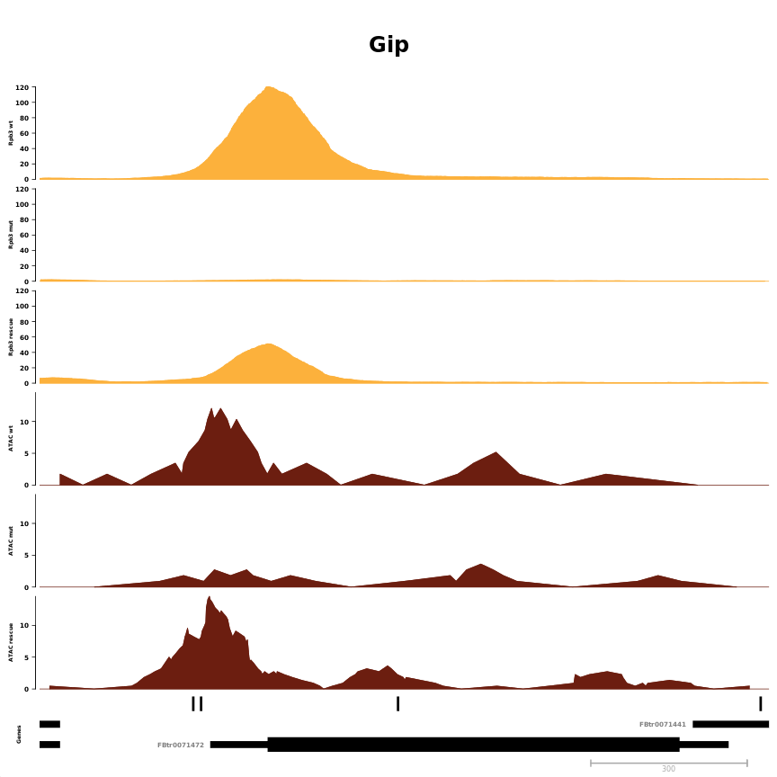

# Single region examples in Lola_mut


**Project:** Promoter Opening

**Author:** [Vivek](mailto:vir@stowers.org)

**Generated:** Sun Sep 15 2019, 08:14 PM


```
##   seqnames    start      end strand  fb_gene_id fb_gene_symbol
## 1    chr3R 30132900 30135600      - FBgn0086355            Tpi
## 2     chrX 10328800 10330200      - FBgn0011770            Gip
## 3    chr3R  7264960  7265938      - FBgn0001112            Gld
## 4    chr2L  1359731  1362160      - FBgn0053126           NLaz
## 5    chr2L  9914465  9917465      + FBgn0040064           yip2
## 6    chr3R 19324949 19326842      - FBgn0000463             Dl
## 7     chrX  5901391  5902473      + FBgn0000042          Act5c
```



```
## [[1]]
## [[1]]$`Rpb3 wt`
## ReferenceDataTrack 'Rpb3 wt'
## | genome: dm6
## | active chromosome: chr3R
## | referenced file: ../bw/Dme_emb_14-17h_Rpb3_2_rpm.bw
## 
## [[1]]$`Rpb3 mut`
## ReferenceDataTrack 'Rpb3 mut'
## | genome: dm6
## | active chromosome: chr3R
## | referenced file: ../bw/Dme_emb_orc4_14-17h_Rpb3_2_rpm.bw
## 
## [[1]]$`Rpb3 rescue`
## ReferenceDataTrack 'Rpb3 rescue'
## | genome: dm6
## | active chromosome: chr3R
## | referenced file: ../bw/dme_emb_act_Lola_I_orc4_14-17h_Rpb3_1_R2_rpm.bw
## 
## [[1]]$`ATAC wt`
## ReferenceDataTrack 'ATAC wt'
## | genome: dm6
## | active chromosome: chr3R
## | referenced file: ../bw/../bw/dme_emb_orer_14_17h_atac_8.bam_from0to100_rpm.bw
## 
## [[1]]$`ATAC mut`
## ReferenceDataTrack 'ATAC mut'
## | genome: dm6
## | active chromosome: chr3R
## | referenced file: ../bw/dme_emb_orc4_14_17h_atac_4.bam_from0to100_rpm.bw
## 
## [[1]]$`ATAC rescue`
## ReferenceDataTrack 'ATAC rescue'
## | genome: dm6
## | active chromosome: chr3R
## | referenced file: ../bw/dme_emb_act_lola_PI_28267_14_17h_atac_3.bam_from0to100_rpm.bw
## 
## [[1]]$Lola_motif
## AnnotationTrack 'Lola_motif'
## | genome: dm6
## | active chromosome: chr3R
## | annotation features: 3
## 
## [[1]]$Genes
## GeneRegionTrack 'Genes'
## | genome: dm6
## | active chromosome: chr3R
## | annotation features: 29
## 
## [[1]]$Axis
## Genome axis 'Axis'
## 
## [[1]]$titles
## An object of class "ImageMap"
## Slot "coords":
##             x1       y1       x2       y2
## Rpb3 wt      6  91.2000 41.14401 201.2082
## Rpb3 mut     6 201.2082 41.14401 311.2165
## Rpb3 rescue  6 311.2165 41.14401 421.2247
## ATAC wt      6 421.2247 41.14401 531.2329
## ATAC mut     6 531.2329 41.14401 641.2412
## ATAC rescue  6 641.2412 41.14401 751.2494
## Lola_motif   6 751.2494 41.14401 773.2511
## Genes        6 773.2511 41.14401 839.2560
## Axis         6 839.2560 41.14401 858.0000
## 
## Slot "tags":
## $title
##       Rpb3 wt      Rpb3 mut   Rpb3 rescue       ATAC wt      ATAC mut 
##     "Rpb3 wt"    "Rpb3 mut" "Rpb3 rescue"     "ATAC wt"    "ATAC mut" 
##   ATAC rescue    Lola_motif         Genes          Axis 
## "ATAC rescue"  "Lola_motif"       "Genes"        "Axis" 
## 
## 
## 
## 
## [[2]]
## [[2]]$`Rpb3 wt`
## ReferenceDataTrack 'Rpb3 wt'
## | genome: dm6
## | active chromosome: chrX
## | referenced file: ../bw/Dme_emb_14-17h_Rpb3_2_rpm.bw
## 
## [[2]]$`Rpb3 mut`
## ReferenceDataTrack 'Rpb3 mut'
## | genome: dm6
## | active chromosome: chrX
## | referenced file: ../bw/Dme_emb_orc4_14-17h_Rpb3_2_rpm.bw
## 
## [[2]]$`Rpb3 rescue`
## ReferenceDataTrack 'Rpb3 rescue'
## | genome: dm6
## | active chromosome: chrX
## | referenced file: ../bw/dme_emb_act_Lola_I_orc4_14-17h_Rpb3_1_R2_rpm.bw
## 
## [[2]]$`ATAC wt`
## ReferenceDataTrack 'ATAC wt'
## | genome: dm6
## | active chromosome: chrX
## | referenced file: ../bw/../bw/dme_emb_orer_14_17h_atac_8.bam_from0to100_rpm.bw
## 
## [[2]]$`ATAC mut`
## ReferenceDataTrack 'ATAC mut'
## | genome: dm6
## | active chromosome: chrX
## | referenced file: ../bw/dme_emb_orc4_14_17h_atac_4.bam_from0to100_rpm.bw
## 
## [[2]]$`ATAC rescue`
## ReferenceDataTrack 'ATAC rescue'
## | genome: dm6
## | active chromosome: chrX
## | referenced file: ../bw/dme_emb_act_lola_PI_28267_14_17h_atac_3.bam_from0to100_rpm.bw
## 
## [[2]]$Lola_motif
## AnnotationTrack 'Lola_motif'
## | genome: dm6
## | active chromosome: chrX
## | annotation features: 4
## 
## [[2]]$Genes
## GeneRegionTrack 'Genes'
## | genome: dm6
## | active chromosome: chrX
## | annotation features: 17
## 
## [[2]]$Axis
## Genome axis 'Axis'
## 
## [[2]]$titles
## An object of class "ImageMap"
## Slot "coords":
##             x1       y1       x2       y2
## Rpb3 wt      6  91.2000 41.14401 204.5418
## Rpb3 mut     6 204.5418 41.14401 317.8836
## Rpb3 rescue  6 317.8836 41.14401 431.2255
## ATAC wt      6 431.2255 41.14401 544.5673
## ATAC mut     6 544.5673 41.14401 657.9091
## ATAC rescue  6 657.9091 41.14401 771.2509
## Lola_motif   6 771.2509 41.14401 793.9193
## Genes        6 793.9193 41.14401 839.2560
## Axis         6 839.2560 41.14401 858.0000
## 
## Slot "tags":
## $title
##       Rpb3 wt      Rpb3 mut   Rpb3 rescue       ATAC wt      ATAC mut 
##     "Rpb3 wt"    "Rpb3 mut" "Rpb3 rescue"     "ATAC wt"    "ATAC mut" 
##   ATAC rescue    Lola_motif         Genes          Axis 
## "ATAC rescue"  "Lola_motif"       "Genes"        "Axis" 
## 
## 
## 
## 
## [[3]]
## [[3]]$`Rpb3 wt`
## ReferenceDataTrack 'Rpb3 wt'
## | genome: dm6
## | active chromosome: chr3R
## | referenced file: ../bw/Dme_emb_14-17h_Rpb3_2_rpm.bw
## 
## [[3]]$`Rpb3 mut`
## ReferenceDataTrack 'Rpb3 mut'
## | genome: dm6
## | active chromosome: chr3R
## | referenced file: ../bw/Dme_emb_orc4_14-17h_Rpb3_2_rpm.bw
## 
## [[3]]$`Rpb3 rescue`
## ReferenceDataTrack 'Rpb3 rescue'
## | genome: dm6
## | active chromosome: chr3R
## | referenced file: ../bw/dme_emb_act_Lola_I_orc4_14-17h_Rpb3_1_R2_rpm.bw
## 
## [[3]]$`ATAC wt`
## ReferenceDataTrack 'ATAC wt'
## | genome: dm6
## | active chromosome: chr3R
## | referenced file: ../bw/../bw/dme_emb_orer_14_17h_atac_8.bam_from0to100_rpm.bw
## 
## [[3]]$`ATAC mut`
## ReferenceDataTrack 'ATAC mut'
## | genome: dm6
## | active chromosome: chr3R
## | referenced file: ../bw/dme_emb_orc4_14_17h_atac_4.bam_from0to100_rpm.bw
## 
## [[3]]$`ATAC rescue`
## ReferenceDataTrack 'ATAC rescue'
## | genome: dm6
## | active chromosome: chr3R
## | referenced file: ../bw/dme_emb_act_lola_PI_28267_14_17h_atac_3.bam_from0to100_rpm.bw
## 
## [[3]]$Lola_motif
## AnnotationTrack 'Lola_motif'
## | genome: dm6
## | active chromosome: chr3R
## | annotation features: 1
## 
## [[3]]$Genes
## GeneRegionTrack 'Genes'
## | genome: dm6
## | active chromosome: chr3R
## | annotation features: 12
## 
## [[3]]$Axis
## Genome axis 'Axis'
## 
## [[3]]$titles
## An object of class "ImageMap"
## Slot "coords":
##             x1       y1       x2       y2
## Rpb3 wt      6  91.2000 41.14401 204.5418
## Rpb3 mut     6 204.5418 41.14401 317.8836
## Rpb3 rescue  6 317.8836 41.14401 431.2255
## ATAC wt      6 431.2255 41.14401 544.5673
## ATAC mut     6 544.5673 41.14401 657.9091
## ATAC rescue  6 657.9091 41.14401 771.2509
## Lola_motif   6 771.2509 41.14401 793.9193
## Genes        6 793.9193 41.14401 839.2560
## Axis         6 839.2560 41.14401 858.0000
## 
## Slot "tags":
## $title
##       Rpb3 wt      Rpb3 mut   Rpb3 rescue       ATAC wt      ATAC mut 
##     "Rpb3 wt"    "Rpb3 mut" "Rpb3 rescue"     "ATAC wt"    "ATAC mut" 
##   ATAC rescue    Lola_motif         Genes          Axis 
## "ATAC rescue"  "Lola_motif"       "Genes"        "Axis" 
## 
## 
## 
## 
## [[4]]
## [[4]]$`Rpb3 wt`
## ReferenceDataTrack 'Rpb3 wt'
## | genome: dm6
## | active chromosome: chr2L
## | referenced file: ../bw/Dme_emb_14-17h_Rpb3_2_rpm.bw
## 
## [[4]]$`Rpb3 mut`
## ReferenceDataTrack 'Rpb3 mut'
## | genome: dm6
## | active chromosome: chr2L
## | referenced file: ../bw/Dme_emb_orc4_14-17h_Rpb3_2_rpm.bw
## 
## [[4]]$`Rpb3 rescue`
## ReferenceDataTrack 'Rpb3 rescue'
## | genome: dm6
## | active chromosome: chr2L
## | referenced file: ../bw/dme_emb_act_Lola_I_orc4_14-17h_Rpb3_1_R2_rpm.bw
## 
## [[4]]$`ATAC wt`
## ReferenceDataTrack 'ATAC wt'
## | genome: dm6
## | active chromosome: chr2L
## | referenced file: ../bw/../bw/dme_emb_orer_14_17h_atac_8.bam_from0to100_rpm.bw
## 
## [[4]]$`ATAC mut`
## ReferenceDataTrack 'ATAC mut'
## | genome: dm6
## | active chromosome: chr2L
## | referenced file: ../bw/dme_emb_orc4_14_17h_atac_4.bam_from0to100_rpm.bw
## 
## [[4]]$`ATAC rescue`
## ReferenceDataTrack 'ATAC rescue'
## | genome: dm6
## | active chromosome: chr2L
## | referenced file: ../bw/dme_emb_act_lola_PI_28267_14_17h_atac_3.bam_from0to100_rpm.bw
## 
## [[4]]$Lola_motif
## AnnotationTrack 'Lola_motif'
## | genome: dm6
## | active chromosome: chr2L
## | annotation features: 2
## 
## [[4]]$Genes
## GeneRegionTrack 'Genes'
## | genome: dm6
## | active chromosome: chr2L
## | annotation features: 37
## 
## [[4]]$Axis
## Genome axis 'Axis'
## 
## [[4]]$titles
## An object of class "ImageMap"
## Slot "coords":
##             x1       y1       x2       y2
## Rpb3 wt      6  91.2000 37.14081 201.2082
## Rpb3 mut     6 201.2082 37.14081 311.2165
## Rpb3 rescue  6 311.2165 37.14081 421.2247
## ATAC wt      6 421.2247 37.14081 531.2329
## ATAC mut     6 531.2329 37.14081 641.2412
## ATAC rescue  6 641.2412 37.14081 751.2494
## Lola_motif   6 751.2494 37.14081 773.2511
## Genes        6 773.2511 37.14081 839.2560
## Axis         6 839.2560 37.14081 858.0000
## 
## Slot "tags":
## $title
##       Rpb3 wt      Rpb3 mut   Rpb3 rescue       ATAC wt      ATAC mut 
##     "Rpb3 wt"    "Rpb3 mut" "Rpb3 rescue"     "ATAC wt"    "ATAC mut" 
##   ATAC rescue    Lola_motif         Genes          Axis 
## "ATAC rescue"  "Lola_motif"       "Genes"        "Axis" 
## 
## 
## 
## 
## [[5]]
## [[5]]$`Rpb3 wt`
## ReferenceDataTrack 'Rpb3 wt'
## | genome: dm6
## | active chromosome: chr2L
## | referenced file: ../bw/Dme_emb_14-17h_Rpb3_2_rpm.bw
## 
## [[5]]$`Rpb3 mut`
## ReferenceDataTrack 'Rpb3 mut'
## | genome: dm6
## | active chromosome: chr2L
## | referenced file: ../bw/Dme_emb_orc4_14-17h_Rpb3_2_rpm.bw
## 
## [[5]]$`Rpb3 rescue`
## ReferenceDataTrack 'Rpb3 rescue'
## | genome: dm6
## | active chromosome: chr2L
## | referenced file: ../bw/dme_emb_act_Lola_I_orc4_14-17h_Rpb3_1_R2_rpm.bw
## 
## [[5]]$`ATAC wt`
## ReferenceDataTrack 'ATAC wt'
## | genome: dm6
## | active chromosome: chr2L
## | referenced file: ../bw/../bw/dme_emb_orer_14_17h_atac_8.bam_from0to100_rpm.bw
## 
## [[5]]$`ATAC mut`
## ReferenceDataTrack 'ATAC mut'
## | genome: dm6
## | active chromosome: chr2L
## | referenced file: ../bw/dme_emb_orc4_14_17h_atac_4.bam_from0to100_rpm.bw
## 
## [[5]]$`ATAC rescue`
## ReferenceDataTrack 'ATAC rescue'
## | genome: dm6
## | active chromosome: chr2L
## | referenced file: ../bw/dme_emb_act_lola_PI_28267_14_17h_atac_3.bam_from0to100_rpm.bw
## 
## [[5]]$Lola_motif
## AnnotationTrack 'Lola_motif'
## | genome: dm6
## | active chromosome: chr2L
## | annotation features: 1
## 
## [[5]]$Genes
## GeneRegionTrack 'Genes'
## | genome: dm6
## | active chromosome: chr2L
## | annotation features: 17
## 
## [[5]]$Axis
## Genome axis 'Axis'
## 
## [[5]]$titles
## An object of class "ImageMap"
## Slot "coords":
##             x1       y1       x2       y2
## Rpb3 wt      6  91.2000 41.14401 201.2082
## Rpb3 mut     6 201.2082 41.14401 311.2165
## Rpb3 rescue  6 311.2165 41.14401 421.2247
## ATAC wt      6 421.2247 41.14401 531.2329
## ATAC mut     6 531.2329 41.14401 641.2412
## ATAC rescue  6 641.2412 41.14401 751.2494
## Lola_motif   6 751.2494 41.14401 773.2511
## Genes        6 773.2511 41.14401 839.2560
## Axis         6 839.2560 41.14401 858.0000
## 
## Slot "tags":
## $title
##       Rpb3 wt      Rpb3 mut   Rpb3 rescue       ATAC wt      ATAC mut 
##     "Rpb3 wt"    "Rpb3 mut" "Rpb3 rescue"     "ATAC wt"    "ATAC mut" 
##   ATAC rescue    Lola_motif         Genes          Axis 
## "ATAC rescue"  "Lola_motif"       "Genes"        "Axis" 
## 
## 
## 
## 
## [[6]]
## [[6]]$`Rpb3 wt`
## ReferenceDataTrack 'Rpb3 wt'
## | genome: dm6
## | active chromosome: chr3R
## | referenced file: ../bw/Dme_emb_14-17h_Rpb3_2_rpm.bw
## 
## [[6]]$`Rpb3 mut`
## ReferenceDataTrack 'Rpb3 mut'
## | genome: dm6
## | active chromosome: chr3R
## | referenced file: ../bw/Dme_emb_orc4_14-17h_Rpb3_2_rpm.bw
## 
## [[6]]$`Rpb3 rescue`
## ReferenceDataTrack 'Rpb3 rescue'
## | genome: dm6
## | active chromosome: chr3R
## | referenced file: ../bw/dme_emb_act_Lola_I_orc4_14-17h_Rpb3_1_R2_rpm.bw
## 
## [[6]]$`ATAC wt`
## ReferenceDataTrack 'ATAC wt'
## | genome: dm6
## | active chromosome: chr3R
## | referenced file: ../bw/../bw/dme_emb_orer_14_17h_atac_8.bam_from0to100_rpm.bw
## 
## [[6]]$`ATAC mut`
## ReferenceDataTrack 'ATAC mut'
## | genome: dm6
## | active chromosome: chr3R
## | referenced file: ../bw/dme_emb_orc4_14_17h_atac_4.bam_from0to100_rpm.bw
## 
## [[6]]$`ATAC rescue`
## ReferenceDataTrack 'ATAC rescue'
## | genome: dm6
## | active chromosome: chr3R
## | referenced file: ../bw/dme_emb_act_lola_PI_28267_14_17h_atac_3.bam_from0to100_rpm.bw
## 
## [[6]]$Lola_motif
## AnnotationTrack 'Lola_motif'
## | genome: dm6
## | active chromosome: chr3R
## | annotation features: 0
## 
## [[6]]$Genes
## GeneRegionTrack 'Genes'
## | genome: dm6
## | active chromosome: chr3R
## | annotation features: 33
## 
## [[6]]$Axis
## Genome axis 'Axis'
## 
## [[6]]$titles
## An object of class "ImageMap"
## Slot "coords":
##             x1       y1       x2       y2
## Rpb3 wt      6  91.2000 41.14401 201.2082
## Rpb3 mut     6 201.2082 41.14401 311.2165
## Rpb3 rescue  6 311.2165 41.14401 421.2247
## ATAC wt      6 421.2247 41.14401 531.2329
## ATAC mut     6 531.2329 41.14401 641.2412
## ATAC rescue  6 641.2412 41.14401 751.2494
## Lola_motif   6 751.2494 41.14401 773.2511
## Genes        6 773.2511 41.14401 839.2560
## Axis         6 839.2560 41.14401 858.0000
## 
## Slot "tags":
## $title
##       Rpb3 wt      Rpb3 mut   Rpb3 rescue       ATAC wt      ATAC mut 
##     "Rpb3 wt"    "Rpb3 mut" "Rpb3 rescue"     "ATAC wt"    "ATAC mut" 
##   ATAC rescue    Lola_motif         Genes          Axis 
## "ATAC rescue"  "Lola_motif"       "Genes"        "Axis" 
## 
## 
## 
## 
## [[7]]
## [[7]]$`Rpb3 wt`
## ReferenceDataTrack 'Rpb3 wt'
## | genome: dm6
## | active chromosome: chrX
## | referenced file: ../bw/Dme_emb_14-17h_Rpb3_2_rpm.bw
## 
## [[7]]$`Rpb3 mut`
## ReferenceDataTrack 'Rpb3 mut'
## | genome: dm6
## | active chromosome: chrX
## | referenced file: ../bw/Dme_emb_orc4_14-17h_Rpb3_2_rpm.bw
## 
## [[7]]$`Rpb3 rescue`
## ReferenceDataTrack 'Rpb3 rescue'
## | genome: dm6
## | active chromosome: chrX
## | referenced file: ../bw/dme_emb_act_Lola_I_orc4_14-17h_Rpb3_1_R2_rpm.bw
## 
## [[7]]$`ATAC wt`
## ReferenceDataTrack 'ATAC wt'
## | genome: dm6
## | active chromosome: chrX
## | referenced file: ../bw/../bw/dme_emb_orer_14_17h_atac_8.bam_from0to100_rpm.bw
## 
## [[7]]$`ATAC mut`
## ReferenceDataTrack 'ATAC mut'
## | genome: dm6
## | active chromosome: chrX
## | referenced file: ../bw/dme_emb_orc4_14_17h_atac_4.bam_from0to100_rpm.bw
## 
## [[7]]$`ATAC rescue`
## ReferenceDataTrack 'ATAC rescue'
## | genome: dm6
## | active chromosome: chrX
## | referenced file: ../bw/dme_emb_act_lola_PI_28267_14_17h_atac_3.bam_from0to100_rpm.bw
## 
## [[7]]$Lola_motif
## AnnotationTrack 'Lola_motif'
## | genome: dm6
## | active chromosome: chrX
## | annotation features: 0
## 
## [[7]]$Genes
## GeneRegionTrack 'Genes'
## | genome: dm6
## | active chromosome: chrX
## | annotation features: 20
## 
## [[7]]$Axis
## Genome axis 'Axis'
## 
## [[7]]$titles
## An object of class "ImageMap"
## Slot "coords":
##             x1       y1       x2       y2
## Rpb3 wt      6  91.2000 41.14401 195.0967
## Rpb3 mut     6 195.0967 41.14401 298.9933
## Rpb3 rescue  6 298.9933 41.14401 402.8900
## ATAC wt      6 402.8900 41.14401 506.7867
## ATAC mut     6 506.7867 41.14401 610.6833
## ATAC rescue  6 610.6833 41.14401 714.5800
## Lola_motif   6 714.5800 41.14401 735.3593
## Genes        6 735.3593 41.14401 839.2560
## Axis         6 839.2560 41.14401 858.0000
## 
## Slot "tags":
## $title
##       Rpb3 wt      Rpb3 mut   Rpb3 rescue       ATAC wt      ATAC mut 
##     "Rpb3 wt"    "Rpb3 mut" "Rpb3 rescue"     "ATAC wt"    "ATAC mut" 
##   ATAC rescue    Lola_motif         Genes          Axis 
## "ATAC rescue"  "Lola_motif"       "Genes"        "Axis"
```


## Session information

For reproducibility, this analysis was performed with the following R/Bioconductor session:


```
R version 3.6.1 (2019-07-05)
Platform: x86_64-pc-linux-gnu (64-bit)
Running under: Ubuntu 18.04.2 LTS

Matrix products: default
BLAS:   /usr/lib/x86_64-linux-gnu/blas/libblas.so.3.7.1
LAPACK: /usr/lib/x86_64-linux-gnu/lapack/liblapack.so.3.7.1

locale:
 [1] LC_CTYPE=C.UTF-8       LC_NUMERIC=C           LC_TIME=C.UTF-8       
 [4] LC_COLLATE=C.UTF-8     LC_MONETARY=C.UTF-8    LC_MESSAGES=C.UTF-8   
 [7] LC_PAPER=C.UTF-8       LC_NAME=C              LC_ADDRESS=C          
[10] LC_TELEPHONE=C         LC_MEASUREMENT=C.UTF-8 LC_IDENTIFICATION=C   

attached base packages:
 [1] grid      stats4    parallel  stats     graphics  grDevices utils    
 [8] datasets  methods   base     

other attached packages:
 [1] pander_0.6.3                             
 [2] Gviz_1.28.1                              
 [3] dplyr_0.8.3                              
 [4] magrittr_1.5                             
 [5] BSgenome.Dmelanogaster.UCSC.dm6_1.4.1    
 [6] BSgenome_1.52.0                          
 [7] rtracklayer_1.44.4                       
 [8] Biostrings_2.52.0                        
 [9] XVector_0.24.0                           
[10] TxDb.Dmelanogaster.UCSC.dm6.ensGene_3.4.6
[11] GenomicFeatures_1.36.4                   
[12] AnnotationDbi_1.46.1                     
[13] Biobase_2.44.0                           
[14] GenomicRanges_1.36.1                     
[15] GenomeInfoDb_1.20.0                      
[16] IRanges_2.18.2                           
[17] S4Vectors_0.22.1                         
[18] BiocGenerics_0.30.0                      
[19] knitr_1.24                               

loaded via a namespace (and not attached):
 [1] ProtGenerics_1.16.0         bitops_1.0-6               
 [3] matrixStats_0.55.0          bit64_0.9-7                
 [5] RColorBrewer_1.1-2          progress_1.2.2             
 [7] httr_1.4.1                  tools_3.6.1                
 [9] backports_1.1.4             R6_2.4.0                   
[11] rpart_4.1-15                Hmisc_4.2-0                
[13] DBI_1.0.0                   lazyeval_0.2.2             
[15] colorspace_1.4-1            nnet_7.3-12                
[17] tidyselect_0.2.5            gridExtra_2.3              
[19] prettyunits_1.0.2           curl_4.0                   
[21] bit_1.1-14                  compiler_3.6.1             
[23] htmlTable_1.13.1            DelayedArray_0.10.0        
[25] scales_1.0.0                checkmate_1.9.4            
[27] stringr_1.4.0               digest_0.6.20              
[29] Rsamtools_2.0.0             foreign_0.8-72             
[31] base64enc_0.1-3             dichromat_2.0-0            
[33] pkgconfig_2.0.2             htmltools_0.3.6            
[35] highr_0.8                   ensembldb_2.8.0            
[37] htmlwidgets_1.3             rlang_0.4.0                
[39] rstudioapi_0.10             RSQLite_2.1.2              
[41] BiocParallel_1.18.1         acepack_1.4.1              
[43] VariantAnnotation_1.30.1    RCurl_1.95-4.12            
[45] GenomeInfoDbData_1.2.1      Formula_1.2-3              
[47] Matrix_1.2-17               Rcpp_1.0.2                 
[49] munsell_0.5.0               stringi_1.4.3              
[51] SummarizedExperiment_1.14.1 zlibbioc_1.30.0            
[53] blob_1.2.0                  crayon_1.3.4               
[55] lattice_0.20-38             splines_3.6.1              
[57] hms_0.5.1                   zeallot_0.1.0              
[59] pillar_1.4.2                biomaRt_2.40.4             
[61] XML_3.98-1.20               glue_1.3.1                 
[63] evaluate_0.14               biovizBase_1.32.0          
[65] latticeExtra_0.6-28         data.table_1.12.2          
[67] vctrs_0.2.0                 gtable_0.3.0               
[69] purrr_0.3.2                 assertthat_0.2.1           
[71] ggplot2_3.2.1               xfun_0.9                   
[73] AnnotationFilter_1.8.0      survival_2.44-1.1          
[75] tibble_2.1.3                GenomicAlignments_1.20.1   
[77] memoise_1.1.0               cluster_2.1.0              
```
