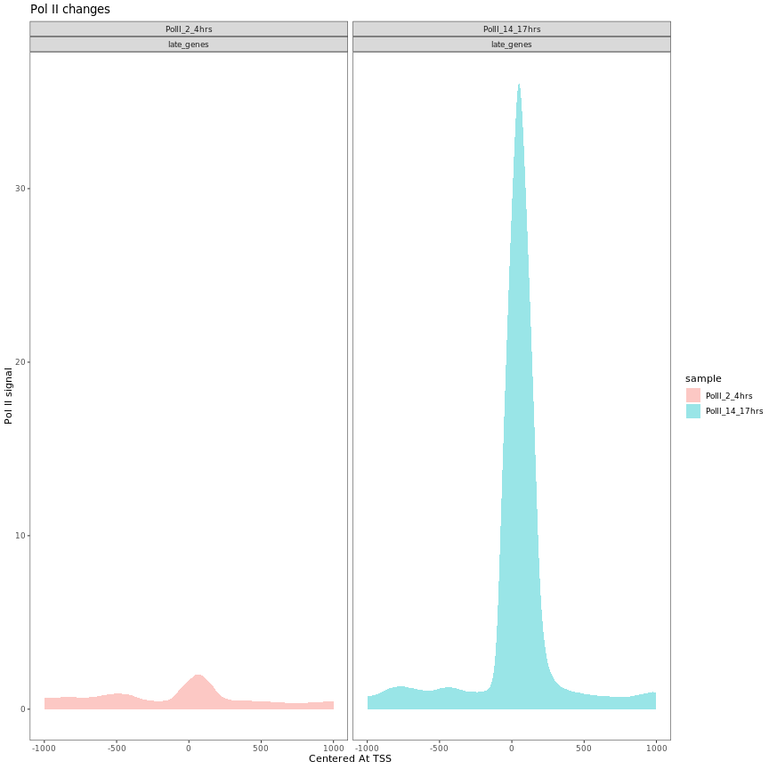
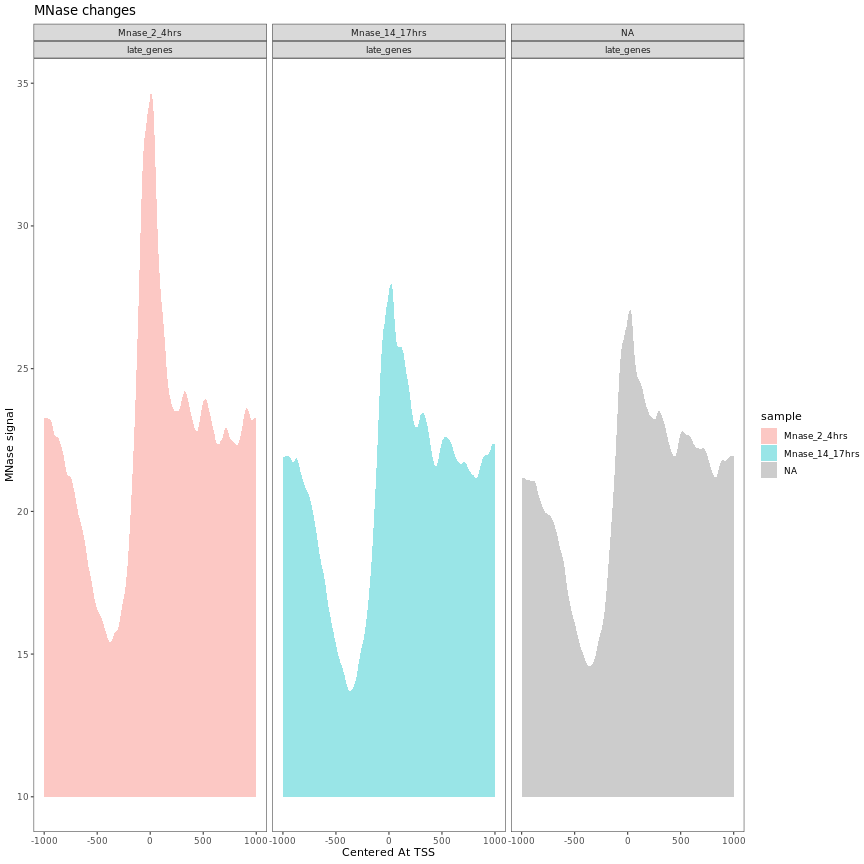
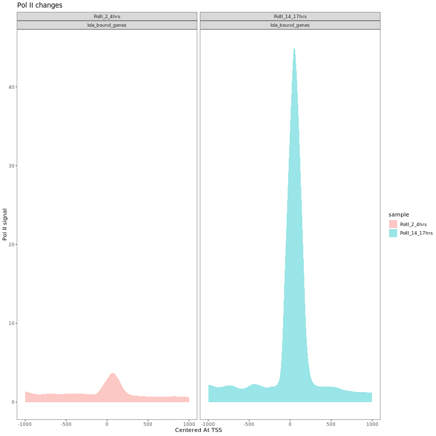
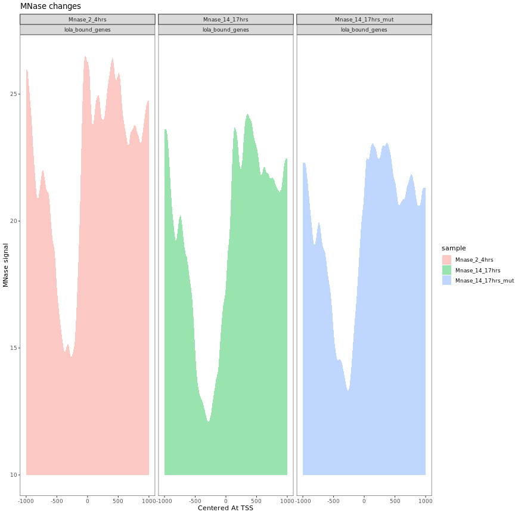
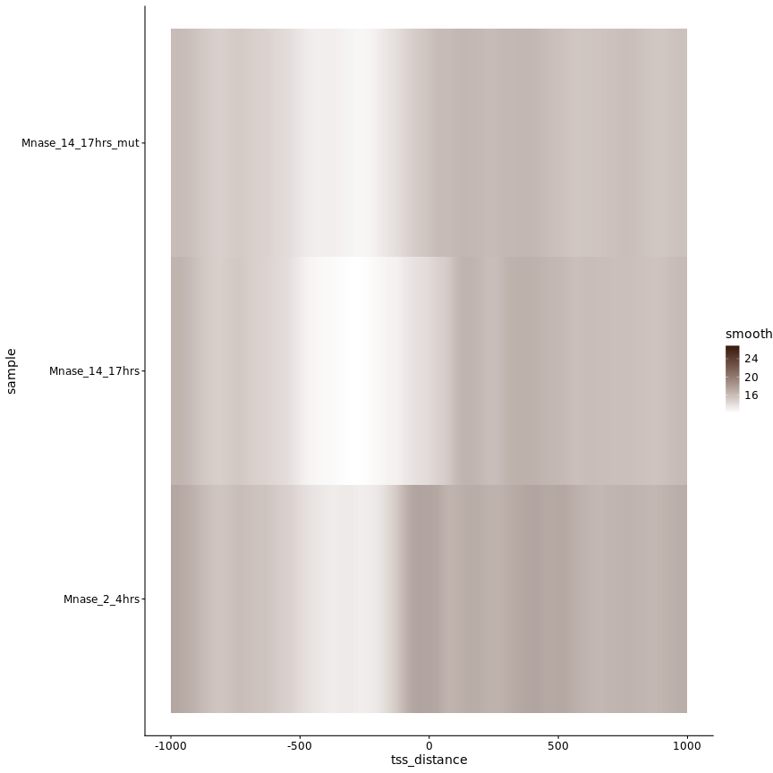

Look at the pol II and MNase profile at Lola target genes

### Lola targets are defined by Lola binding- top 1000 peaks

**Project:** Promoter Opening

**Author:** [Vivek](mailto:vir@stowers.org)

**Generated:** Sat Sep 21 2019, 09:34 PM


```
## Metagene call
## Metagene call
## Metagene call
## Metagene call
```

```
## Metagene call for 492 genes (X[[i]])
## Metagene call for 492 genes (X[[i]])
## Metagene call for 492 genes (X[[i]])
```




```
## Metagene call
## Metagene call
## Metagene call
## Metagene call
```

```
## Metagene call for 329 genes (X[[i]])
## Metagene call for 329 genes (X[[i]])
## Metagene call for 329 genes (X[[i]])
```



## Session information

For reproducibility, this analysis was performed with the following R/Bioconductor session:


```
R version 3.6.1 (2019-07-05)
Platform: x86_64-pc-linux-gnu (64-bit)
Running under: Ubuntu 18.04.2 LTS

Matrix products: default
BLAS:   /usr/lib/x86_64-linux-gnu/blas/libblas.so.3.7.1
LAPACK: /usr/lib/x86_64-linux-gnu/lapack/liblapack.so.3.7.1

locale:
 [1] LC_CTYPE=C.UTF-8       LC_NUMERIC=C           LC_TIME=C.UTF-8       
 [4] LC_COLLATE=C.UTF-8     LC_MONETARY=C.UTF-8    LC_MESSAGES=C.UTF-8   
 [7] LC_PAPER=C.UTF-8       LC_NAME=C              LC_ADDRESS=C          
[10] LC_TELEPHONE=C         LC_MEASUREMENT=C.UTF-8 LC_IDENTIFICATION=C   

attached base packages:
[1] parallel  stats4    stats     graphics  grDevices utils     datasets 
[8] methods   base     

other attached packages:
 [1] BSgenome.Dmelanogaster.UCSC.dm6_1.4.1 BSgenome_1.52.0                      
 [3] Biostrings_2.52.0                     XVector_0.24.0                       
 [5] matrixStats_0.55.0                    pander_0.6.3                         
 [7] cowplot_1.0.0                         Hmisc_4.2-0                          
 [9] Formula_1.2-3                         survival_2.44-1.1                    
[11] lattice_0.20-38                       magrittr_1.5                         
[13] dplyr_0.8.3                           ggplot2_3.2.1                        
[15] rtracklayer_1.44.4                    GenomicRanges_1.36.1                 
[17] GenomeInfoDb_1.20.0                   IRanges_2.18.2                       
[19] S4Vectors_0.22.1                      BiocGenerics_0.30.0                  
[21] knitr_1.24                           

loaded via a namespace (and not attached):
 [1] Rcpp_1.0.2                  Rsamtools_2.0.0            
 [3] assertthat_0.2.1            digest_0.6.20              
 [5] R6_2.4.0                    backports_1.1.4            
 [7] acepack_1.4.1               evaluate_0.14              
 [9] highr_0.8                   pillar_1.4.2               
[11] zlibbioc_1.30.0             rlang_0.4.0                
[13] lazyeval_0.2.2              data.table_1.12.2          
[15] rstudioapi_0.10             rpart_4.1-15               
[17] Matrix_1.2-17               checkmate_1.9.4            
[19] labeling_0.3                splines_3.6.1              
[21] BiocParallel_1.18.1         stringr_1.4.0              
[23] foreign_0.8-72              htmlwidgets_1.3            
[25] RCurl_1.95-4.12             munsell_0.5.0              
[27] DelayedArray_0.10.0         compiler_3.6.1             
[29] xfun_0.9                    pkgconfig_2.0.2            
[31] base64enc_0.1-3             htmltools_0.3.6            
[33] nnet_7.3-12                 tidyselect_0.2.5           
[35] SummarizedExperiment_1.14.1 tibble_2.1.3               
[37] gridExtra_2.3               htmlTable_1.13.1           
[39] GenomeInfoDbData_1.2.1      XML_3.98-1.20              
[41] crayon_1.3.4                withr_2.1.2                
[43] GenomicAlignments_1.20.1    bitops_1.0-6               
[45] grid_3.6.1                  gtable_0.3.0               
[47] scales_1.0.0                stringi_1.4.3              
[49] latticeExtra_0.6-28         RColorBrewer_1.1-2         
[51] tools_3.6.1                 Biobase_2.44.0             
[53] glue_1.3.1                  purrr_0.3.2                
[55] colorspace_1.4-1            cluster_2.1.0              
```
