# Single region examples in Lola_mut


**Project:** Promoter Opening

**Author:** [Vivek](mailto:vir@stowers.org)

**Generated:** Sun Sep 15 2019, 07:38 PM


```
##   seqnames    start      end strand  fb_gene_id fb_gene_symbol  h_start
## 1    chr3R 30132900 30135600      - FBgn0086355            Tpi 30134205
## 2     chrX 10328800 10330200      - FBgn0011770            Gip 10329799
## 3    chr3R  7264960  7265938      - FBgn0001112            Gld  7265638
## 4    chr2L  1359731  1362160      - FBgn0053126           NLaz  1361590
## 5    chr2L  9914465  9917465      + FBgn0040064           yip2  9915105
## 6    chr3R 19324949 19326842      - FBgn0000463             Dl 19324949
## 7     chrX  5901391  5902473      + FBgn0000042          Act5c  5901391
##      h_end
## 1 30134748
## 2 10330041
## 3  7265908
## 4  1361934
## 5  9915378
## 6 19326842
## 7  5902473
```

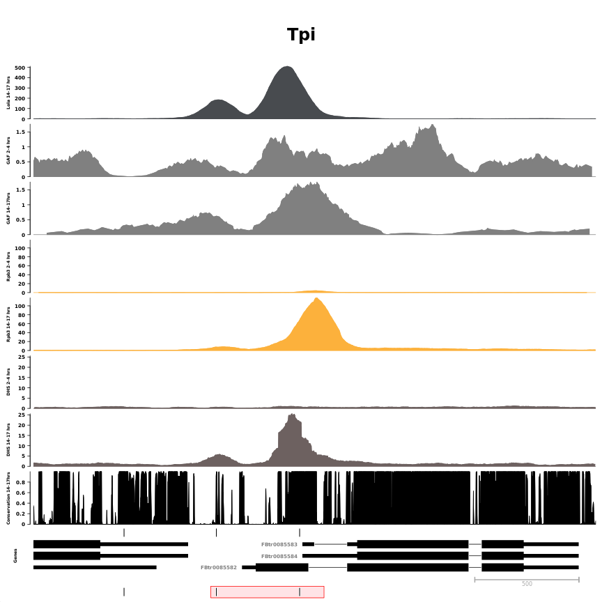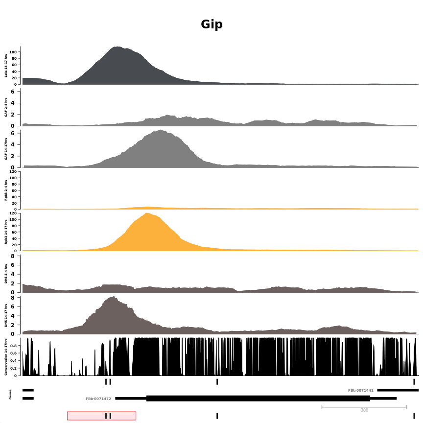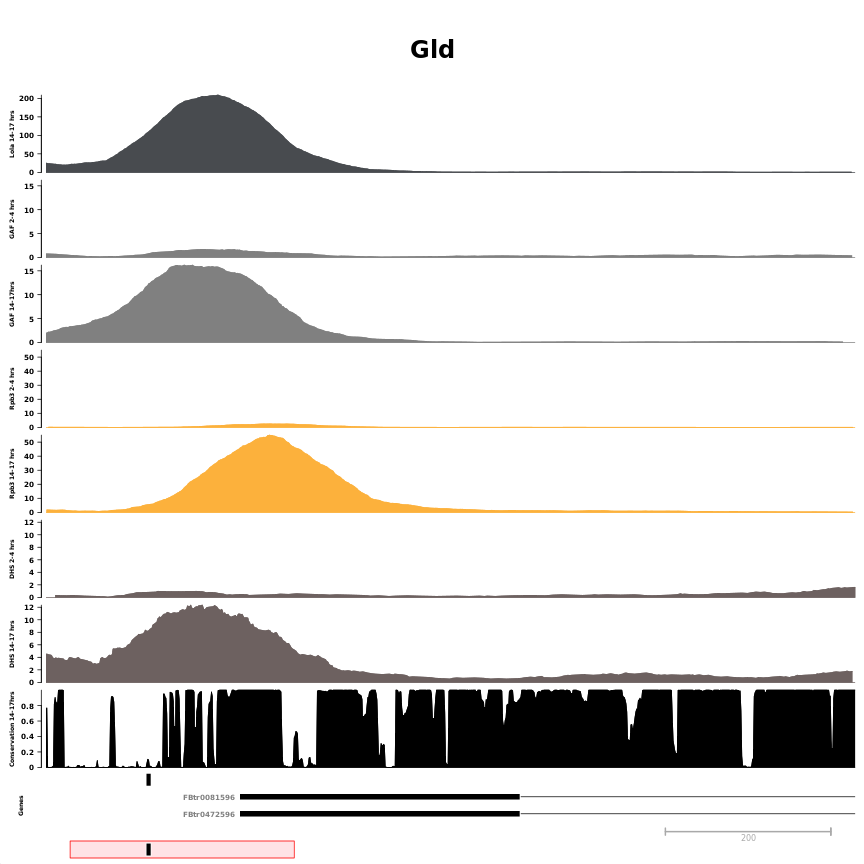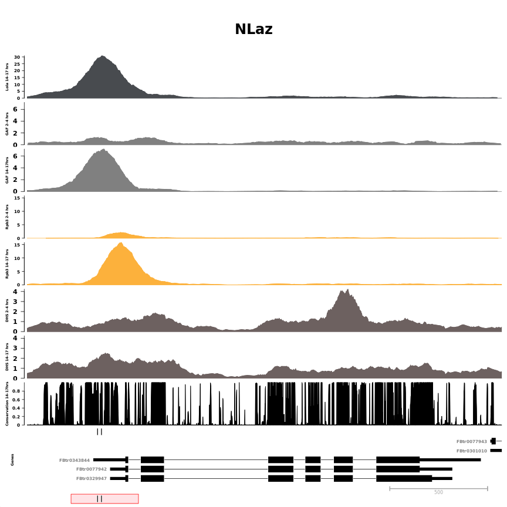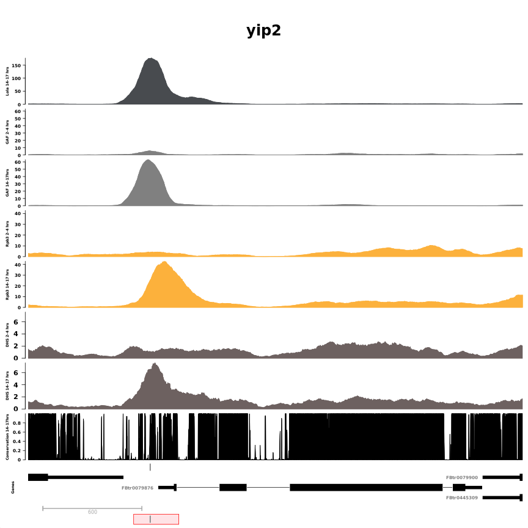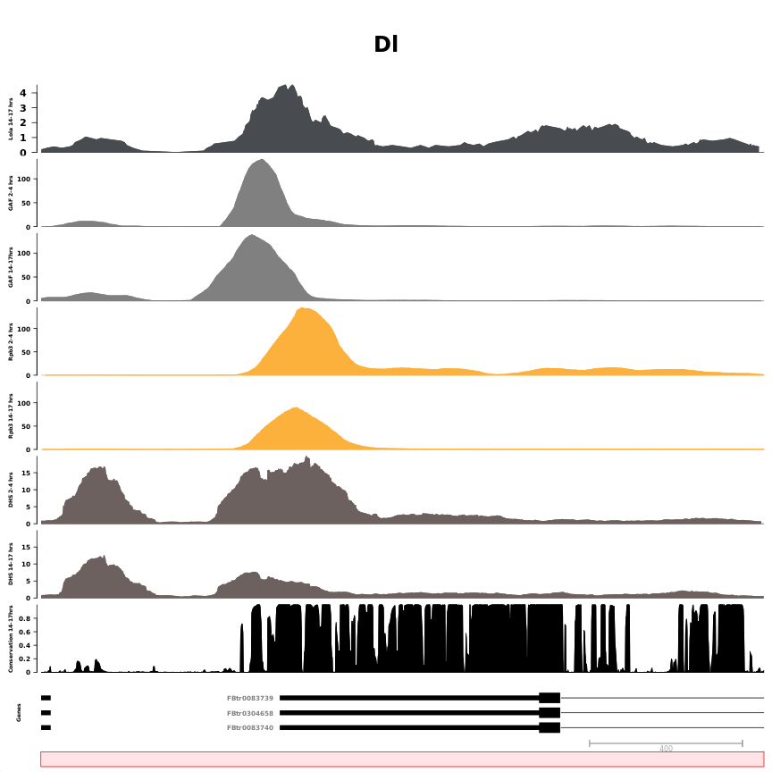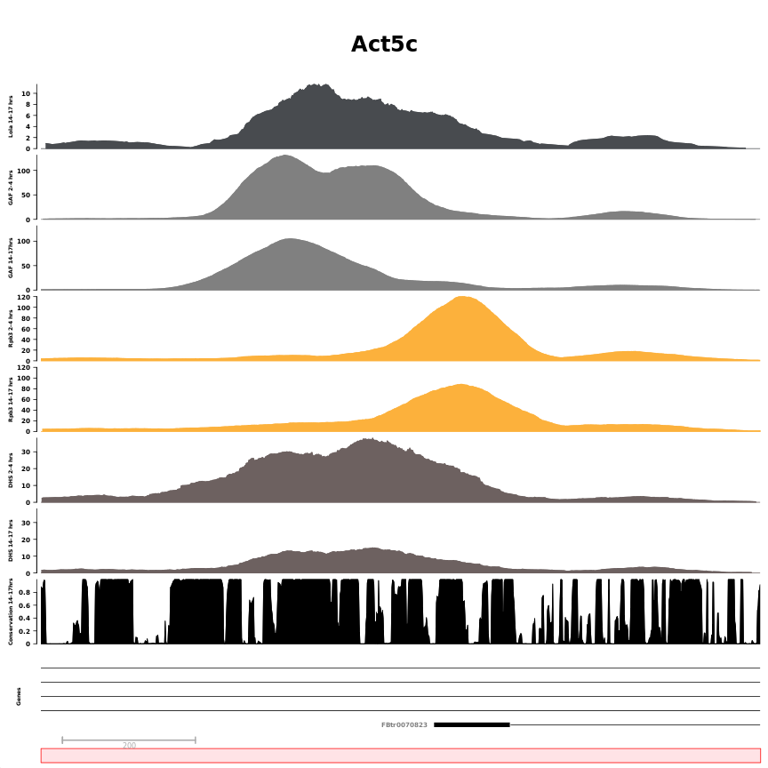

```
## [[1]]
## [[1]]$`Lola 14-17 hrs`
## ReferenceDataTrack 'Lola 14-17 hrs'
## | genome: dm6
## | active chromosome: chr3R
## | referenced file: ../bw/Dme_emb_14-17h_Lola_I_2_rpm.bw
## 
## [[1]]$`GAF 2-4 hrs`
## ReferenceDataTrack 'GAF 2-4 hrs'
## | genome: dm6
## | active chromosome: chr3R
## | referenced file: ../bw/Dme_emb_2-4h_GAF_2_R2_rpm.bw
## 
## [[1]]$`GAF 14-17hrs`
## ReferenceDataTrack 'GAF 14-17hrs'
## | genome: dm6
## | active chromosome: chr3R
## | referenced file: ../bw/Dme_emb_14-17h_GAF_2_rpm.bw
## 
## [[1]]$`Rpb3 2-4 hrs`
## ReferenceDataTrack 'Rpb3 2-4 hrs'
## | genome: dm6
## | active chromosome: chr3R
## | referenced file: ../bw/Dme_emb_2-4h_Rpb3_2_R2_rpm.bw
## 
## [[1]]$`Rpb3 14-17 hrs`
## ReferenceDataTrack 'Rpb3 14-17 hrs'
## | genome: dm6
## | active chromosome: chr3R
## | referenced file: ../bw/Dme_emb_14-17h_Rpb3_2_rpm.bw
## 
## [[1]]$`DHS 2-4 hrs`
## ReferenceDataTrack 'DHS 2-4 hrs'
## | genome: dm6
## | active chromosome: chr3R
## | referenced file: ../bw/stage05_rpm.bw
## 
## [[1]]$`DHS 14-17 hrs`
## ReferenceDataTrack 'DHS 14-17 hrs'
## | genome: dm6
## | active chromosome: chr3R
## | referenced file: ../bw/stage14_rpm.bw
## 
## [[1]]$`Conservation 14-17hrs`
## ReferenceDataTrack 'Conservation 14-17hrs'
## | genome: dm6
## | active chromosome: chr3R
## | referenced file: ../external_data/conservation/dm6.phastCons124way.bw
## 
## [[1]]$Lola_motif
## AnnotationTrack 'Lola_motif'
## | genome: dm6
## | active chromosome: chr3R
## | annotation features: 3
## 
## [[1]]$Genes
## GeneRegionTrack 'Genes'
## | genome: dm6
## | active chromosome: chr3R
## | annotation features: 29
## 
## [[1]]$Axis
## Genome axis 'Axis'
## 
## [[1]]$Lola_motif
## AnnotationTrack 'Lola_motif'
## | genome: dm6
## | active chromosome: chr3R
## | annotation features: 3
## 
## [[1]]$titles
## An object of class "ImageMap"
## Slot "coords":
##                       x1       y1       x2       y2
## Lola 14-17 hrs         6  91.2000 45.14721 174.3173
## GAF 2-4 hrs            6 174.3173 45.14721 257.4347
## GAF 14-17hrs           6 257.4347 45.14721 340.5520
## Rpb3 2-4 hrs           6 340.5520 45.14721 423.6693
## Rpb3 14-17 hrs         6 423.6693 45.14721 506.7867
## DHS 2-4 hrs            6 506.7867 45.14721 589.9040
## DHS 14-17 hrs          6 589.9040 45.14721 673.0213
## Conservation 14-17hrs  6 673.0213 45.14721 756.1387
## Lola_motif             6 756.1387 45.14721 772.7621
## Genes                  6 772.7621 45.14721 822.6325
## Axis                   6 822.6325 45.14721 841.3765
## Lola_motif             6 841.3765 45.14721 858.0000
## 
## Slot "tags":
## $title
##          Lola 14-17 hrs             GAF 2-4 hrs            GAF 14-17hrs 
##        "Lola 14-17 hrs"           "GAF 2-4 hrs"          "GAF 14-17hrs" 
##            Rpb3 2-4 hrs          Rpb3 14-17 hrs             DHS 2-4 hrs 
##          "Rpb3 2-4 hrs"        "Rpb3 14-17 hrs"           "DHS 2-4 hrs" 
##           DHS 14-17 hrs   Conservation 14-17hrs              Lola_motif 
##         "DHS 14-17 hrs" "Conservation 14-17hrs"            "Lola_motif" 
##                   Genes                    Axis              Lola_motif 
##                 "Genes"                  "Axis"            "Lola_motif" 
## 
## 
## 
## 
## [[2]]
## [[2]]$`Lola 14-17 hrs`
## ReferenceDataTrack 'Lola 14-17 hrs'
## | genome: dm6
## | active chromosome: chrX
## | referenced file: ../bw/Dme_emb_14-17h_Lola_I_2_rpm.bw
## 
## [[2]]$`GAF 2-4 hrs`
## ReferenceDataTrack 'GAF 2-4 hrs'
## | genome: dm6
## | active chromosome: chrX
## | referenced file: ../bw/Dme_emb_2-4h_GAF_2_R2_rpm.bw
## 
## [[2]]$`GAF 14-17hrs`
## ReferenceDataTrack 'GAF 14-17hrs'
## | genome: dm6
## | active chromosome: chrX
## | referenced file: ../bw/Dme_emb_14-17h_GAF_2_rpm.bw
## 
## [[2]]$`Rpb3 2-4 hrs`
## ReferenceDataTrack 'Rpb3 2-4 hrs'
## | genome: dm6
## | active chromosome: chrX
## | referenced file: ../bw/Dme_emb_2-4h_Rpb3_2_R2_rpm.bw
## 
## [[2]]$`Rpb3 14-17 hrs`
## ReferenceDataTrack 'Rpb3 14-17 hrs'
## | genome: dm6
## | active chromosome: chrX
## | referenced file: ../bw/Dme_emb_14-17h_Rpb3_2_rpm.bw
## 
## [[2]]$`DHS 2-4 hrs`
## ReferenceDataTrack 'DHS 2-4 hrs'
## | genome: dm6
## | active chromosome: chrX
## | referenced file: ../bw/stage05_rpm.bw
## 
## [[2]]$`DHS 14-17 hrs`
## ReferenceDataTrack 'DHS 14-17 hrs'
## | genome: dm6
## | active chromosome: chrX
## | referenced file: ../bw/stage14_rpm.bw
## 
## [[2]]$`Conservation 14-17hrs`
## ReferenceDataTrack 'Conservation 14-17hrs'
## | genome: dm6
## | active chromosome: chrX
## | referenced file: ../external_data/conservation/dm6.phastCons124way.bw
## 
## [[2]]$Lola_motif
## AnnotationTrack 'Lola_motif'
## | genome: dm6
## | active chromosome: chrX
## | annotation features: 4
## 
## [[2]]$Genes
## GeneRegionTrack 'Genes'
## | genome: dm6
## | active chromosome: chrX
## | annotation features: 17
## 
## [[2]]$Axis
## Genome axis 'Axis'
## 
## [[2]]$Lola_motif
## AnnotationTrack 'Lola_motif'
## | genome: dm6
## | active chromosome: chrX
## | annotation features: 4
## 
## [[2]]$titles
## An object of class "ImageMap"
## Slot "coords":
##                       x1       y1       x2       y2
## Lola 14-17 hrs         6  91.2000 43.14561 176.2064
## GAF 2-4 hrs            6 176.2064 43.14561 261.2127
## GAF 14-17hrs           6 261.2127 43.14561 346.2191
## Rpb3 2-4 hrs           6 346.2191 43.14561 431.2255
## Rpb3 14-17 hrs         6 431.2255 43.14561 516.2318
## DHS 2-4 hrs            6 516.2318 43.14561 601.2382
## DHS 14-17 hrs          6 601.2382 43.14561 686.2445
## Conservation 14-17hrs  6 686.2445 43.14561 771.2509
## Lola_motif             6 771.2509 43.14561 788.2522
## Genes                  6 788.2522 43.14561 822.2547
## Axis                   6 822.2547 43.14561 840.9987
## Lola_motif             6 840.9987 43.14561 858.0000
## 
## Slot "tags":
## $title
##          Lola 14-17 hrs             GAF 2-4 hrs            GAF 14-17hrs 
##        "Lola 14-17 hrs"           "GAF 2-4 hrs"          "GAF 14-17hrs" 
##            Rpb3 2-4 hrs          Rpb3 14-17 hrs             DHS 2-4 hrs 
##          "Rpb3 2-4 hrs"        "Rpb3 14-17 hrs"           "DHS 2-4 hrs" 
##           DHS 14-17 hrs   Conservation 14-17hrs              Lola_motif 
##         "DHS 14-17 hrs" "Conservation 14-17hrs"            "Lola_motif" 
##                   Genes                    Axis              Lola_motif 
##                 "Genes"                  "Axis"            "Lola_motif" 
## 
## 
## 
## 
## [[3]]
## [[3]]$`Lola 14-17 hrs`
## ReferenceDataTrack 'Lola 14-17 hrs'
## | genome: dm6
## | active chromosome: chr3R
## | referenced file: ../bw/Dme_emb_14-17h_Lola_I_2_rpm.bw
## 
## [[3]]$`GAF 2-4 hrs`
## ReferenceDataTrack 'GAF 2-4 hrs'
## | genome: dm6
## | active chromosome: chr3R
## | referenced file: ../bw/Dme_emb_2-4h_GAF_2_R2_rpm.bw
## 
## [[3]]$`GAF 14-17hrs`
## ReferenceDataTrack 'GAF 14-17hrs'
## | genome: dm6
## | active chromosome: chr3R
## | referenced file: ../bw/Dme_emb_14-17h_GAF_2_rpm.bw
## 
## [[3]]$`Rpb3 2-4 hrs`
## ReferenceDataTrack 'Rpb3 2-4 hrs'
## | genome: dm6
## | active chromosome: chr3R
## | referenced file: ../bw/Dme_emb_2-4h_Rpb3_2_R2_rpm.bw
## 
## [[3]]$`Rpb3 14-17 hrs`
## ReferenceDataTrack 'Rpb3 14-17 hrs'
## | genome: dm6
## | active chromosome: chr3R
## | referenced file: ../bw/Dme_emb_14-17h_Rpb3_2_rpm.bw
## 
## [[3]]$`DHS 2-4 hrs`
## ReferenceDataTrack 'DHS 2-4 hrs'
## | genome: dm6
## | active chromosome: chr3R
## | referenced file: ../bw/stage05_rpm.bw
## 
## [[3]]$`DHS 14-17 hrs`
## ReferenceDataTrack 'DHS 14-17 hrs'
## | genome: dm6
## | active chromosome: chr3R
## | referenced file: ../bw/stage14_rpm.bw
## 
## [[3]]$`Conservation 14-17hrs`
## ReferenceDataTrack 'Conservation 14-17hrs'
## | genome: dm6
## | active chromosome: chr3R
## | referenced file: ../external_data/conservation/dm6.phastCons124way.bw
## 
## [[3]]$Lola_motif
## AnnotationTrack 'Lola_motif'
## | genome: dm6
## | active chromosome: chr3R
## | annotation features: 1
## 
## [[3]]$Genes
## GeneRegionTrack 'Genes'
## | genome: dm6
## | active chromosome: chr3R
## | annotation features: 12
## 
## [[3]]$Axis
## Genome axis 'Axis'
## 
## [[3]]$Lola_motif
## AnnotationTrack 'Lola_motif'
## | genome: dm6
## | active chromosome: chr3R
## | annotation features: 1
## 
## [[3]]$titles
## An object of class "ImageMap"
## Slot "coords":
##                       x1       y1       x2       y2
## Lola 14-17 hrs         6  91.2000 43.14561 176.2064
## GAF 2-4 hrs            6 176.2064 43.14561 261.2127
## GAF 14-17hrs           6 261.2127 43.14561 346.2191
## Rpb3 2-4 hrs           6 346.2191 43.14561 431.2255
## Rpb3 14-17 hrs         6 431.2255 43.14561 516.2318
## DHS 2-4 hrs            6 516.2318 43.14561 601.2382
## DHS 14-17 hrs          6 601.2382 43.14561 686.2445
## Conservation 14-17hrs  6 686.2445 43.14561 771.2509
## Lola_motif             6 771.2509 43.14561 788.2522
## Genes                  6 788.2522 43.14561 822.2547
## Axis                   6 822.2547 43.14561 840.9987
## Lola_motif             6 840.9987 43.14561 858.0000
## 
## Slot "tags":
## $title
##          Lola 14-17 hrs             GAF 2-4 hrs            GAF 14-17hrs 
##        "Lola 14-17 hrs"           "GAF 2-4 hrs"          "GAF 14-17hrs" 
##            Rpb3 2-4 hrs          Rpb3 14-17 hrs             DHS 2-4 hrs 
##          "Rpb3 2-4 hrs"        "Rpb3 14-17 hrs"           "DHS 2-4 hrs" 
##           DHS 14-17 hrs   Conservation 14-17hrs              Lola_motif 
##         "DHS 14-17 hrs" "Conservation 14-17hrs"            "Lola_motif" 
##                   Genes                    Axis              Lola_motif 
##                 "Genes"                  "Axis"            "Lola_motif" 
## 
## 
## 
## 
## [[4]]
## [[4]]$`Lola 14-17 hrs`
## ReferenceDataTrack 'Lola 14-17 hrs'
## | genome: dm6
## | active chromosome: chr2L
## | referenced file: ../bw/Dme_emb_14-17h_Lola_I_2_rpm.bw
## 
## [[4]]$`GAF 2-4 hrs`
## ReferenceDataTrack 'GAF 2-4 hrs'
## | genome: dm6
## | active chromosome: chr2L
## | referenced file: ../bw/Dme_emb_2-4h_GAF_2_R2_rpm.bw
## 
## [[4]]$`GAF 14-17hrs`
## ReferenceDataTrack 'GAF 14-17hrs'
## | genome: dm6
## | active chromosome: chr2L
## | referenced file: ../bw/Dme_emb_14-17h_GAF_2_rpm.bw
## 
## [[4]]$`Rpb3 2-4 hrs`
## ReferenceDataTrack 'Rpb3 2-4 hrs'
## | genome: dm6
## | active chromosome: chr2L
## | referenced file: ../bw/Dme_emb_2-4h_Rpb3_2_R2_rpm.bw
## 
## [[4]]$`Rpb3 14-17 hrs`
## ReferenceDataTrack 'Rpb3 14-17 hrs'
## | genome: dm6
## | active chromosome: chr2L
## | referenced file: ../bw/Dme_emb_14-17h_Rpb3_2_rpm.bw
## 
## [[4]]$`DHS 2-4 hrs`
## ReferenceDataTrack 'DHS 2-4 hrs'
## | genome: dm6
## | active chromosome: chr2L
## | referenced file: ../bw/stage05_rpm.bw
## 
## [[4]]$`DHS 14-17 hrs`
## ReferenceDataTrack 'DHS 14-17 hrs'
## | genome: dm6
## | active chromosome: chr2L
## | referenced file: ../bw/stage14_rpm.bw
## 
## [[4]]$`Conservation 14-17hrs`
## ReferenceDataTrack 'Conservation 14-17hrs'
## | genome: dm6
## | active chromosome: chr2L
## | referenced file: ../external_data/conservation/dm6.phastCons124way.bw
## 
## [[4]]$Lola_motif
## AnnotationTrack 'Lola_motif'
## | genome: dm6
## | active chromosome: chr2L
## | annotation features: 2
## 
## [[4]]$Genes
## GeneRegionTrack 'Genes'
## | genome: dm6
## | active chromosome: chr2L
## | annotation features: 37
## 
## [[4]]$Axis
## Genome axis 'Axis'
## 
## [[4]]$Lola_motif
## AnnotationTrack 'Lola_motif'
## | genome: dm6
## | active chromosome: chr2L
## | annotation features: 2
## 
## [[4]]$titles
## An object of class "ImageMap"
## Slot "coords":
##                       x1       y1       x2       y2
## Lola 14-17 hrs         6  91.2000 43.14561 170.7804
## GAF 2-4 hrs            6 170.7804 43.14561 250.3609
## GAF 14-17hrs           6 250.3609 43.14561 329.9413
## Rpb3 2-4 hrs           6 329.9413 43.14561 409.5217
## Rpb3 14-17 hrs         6 409.5217 43.14561 489.1021
## DHS 2-4 hrs            6 489.1021 43.14561 568.6826
## DHS 14-17 hrs          6 568.6826 43.14561 648.2630
## Conservation 14-17hrs  6 648.2630 43.14561 727.8434
## Lola_motif             6 727.8434 43.14561 743.7595
## Genes                  6 743.7595 43.14561 823.3399
## Axis                   6 823.3399 43.14561 842.0839
## Lola_motif             6 842.0839 43.14561 858.0000
## 
## Slot "tags":
## $title
##          Lola 14-17 hrs             GAF 2-4 hrs            GAF 14-17hrs 
##        "Lola 14-17 hrs"           "GAF 2-4 hrs"          "GAF 14-17hrs" 
##            Rpb3 2-4 hrs          Rpb3 14-17 hrs             DHS 2-4 hrs 
##          "Rpb3 2-4 hrs"        "Rpb3 14-17 hrs"           "DHS 2-4 hrs" 
##           DHS 14-17 hrs   Conservation 14-17hrs              Lola_motif 
##         "DHS 14-17 hrs" "Conservation 14-17hrs"            "Lola_motif" 
##                   Genes                    Axis              Lola_motif 
##                 "Genes"                  "Axis"            "Lola_motif" 
## 
## 
## 
## 
## [[5]]
## [[5]]$`Lola 14-17 hrs`
## ReferenceDataTrack 'Lola 14-17 hrs'
## | genome: dm6
## | active chromosome: chr2L
## | referenced file: ../bw/Dme_emb_14-17h_Lola_I_2_rpm.bw
## 
## [[5]]$`GAF 2-4 hrs`
## ReferenceDataTrack 'GAF 2-4 hrs'
## | genome: dm6
## | active chromosome: chr2L
## | referenced file: ../bw/Dme_emb_2-4h_GAF_2_R2_rpm.bw
## 
## [[5]]$`GAF 14-17hrs`
## ReferenceDataTrack 'GAF 14-17hrs'
## | genome: dm6
## | active chromosome: chr2L
## | referenced file: ../bw/Dme_emb_14-17h_GAF_2_rpm.bw
## 
## [[5]]$`Rpb3 2-4 hrs`
## ReferenceDataTrack 'Rpb3 2-4 hrs'
## | genome: dm6
## | active chromosome: chr2L
## | referenced file: ../bw/Dme_emb_2-4h_Rpb3_2_R2_rpm.bw
## 
## [[5]]$`Rpb3 14-17 hrs`
## ReferenceDataTrack 'Rpb3 14-17 hrs'
## | genome: dm6
## | active chromosome: chr2L
## | referenced file: ../bw/Dme_emb_14-17h_Rpb3_2_rpm.bw
## 
## [[5]]$`DHS 2-4 hrs`
## ReferenceDataTrack 'DHS 2-4 hrs'
## | genome: dm6
## | active chromosome: chr2L
## | referenced file: ../bw/stage05_rpm.bw
## 
## [[5]]$`DHS 14-17 hrs`
## ReferenceDataTrack 'DHS 14-17 hrs'
## | genome: dm6
## | active chromosome: chr2L
## | referenced file: ../bw/stage14_rpm.bw
## 
## [[5]]$`Conservation 14-17hrs`
## ReferenceDataTrack 'Conservation 14-17hrs'
## | genome: dm6
## | active chromosome: chr2L
## | referenced file: ../external_data/conservation/dm6.phastCons124way.bw
## 
## [[5]]$Lola_motif
## AnnotationTrack 'Lola_motif'
## | genome: dm6
## | active chromosome: chr2L
## | annotation features: 1
## 
## [[5]]$Genes
## GeneRegionTrack 'Genes'
## | genome: dm6
## | active chromosome: chr2L
## | annotation features: 17
## 
## [[5]]$Axis
## Genome axis 'Axis'
## 
## [[5]]$Lola_motif
## AnnotationTrack 'Lola_motif'
## | genome: dm6
## | active chromosome: chr2L
## | annotation features: 1
## 
## [[5]]$titles
## An object of class "ImageMap"
## Slot "coords":
##                       x1       y1       x2       y2
## Lola 14-17 hrs         6  91.2000 43.14561 174.3173
## GAF 2-4 hrs            6 174.3173 43.14561 257.4347
## GAF 14-17hrs           6 257.4347 43.14561 340.5520
## Rpb3 2-4 hrs           6 340.5520 43.14561 423.6693
## Rpb3 14-17 hrs         6 423.6693 43.14561 506.7867
## DHS 2-4 hrs            6 506.7867 43.14561 589.9040
## DHS 14-17 hrs          6 589.9040 43.14561 673.0213
## Conservation 14-17hrs  6 673.0213 43.14561 756.1387
## Lola_motif             6 756.1387 43.14561 772.7621
## Genes                  6 772.7621 43.14561 822.6325
## Axis                   6 822.6325 43.14561 841.3765
## Lola_motif             6 841.3765 43.14561 858.0000
## 
## Slot "tags":
## $title
##          Lola 14-17 hrs             GAF 2-4 hrs            GAF 14-17hrs 
##        "Lola 14-17 hrs"           "GAF 2-4 hrs"          "GAF 14-17hrs" 
##            Rpb3 2-4 hrs          Rpb3 14-17 hrs             DHS 2-4 hrs 
##          "Rpb3 2-4 hrs"        "Rpb3 14-17 hrs"           "DHS 2-4 hrs" 
##           DHS 14-17 hrs   Conservation 14-17hrs              Lola_motif 
##         "DHS 14-17 hrs" "Conservation 14-17hrs"            "Lola_motif" 
##                   Genes                    Axis              Lola_motif 
##                 "Genes"                  "Axis"            "Lola_motif" 
## 
## 
## 
## 
## [[6]]
## [[6]]$`Lola 14-17 hrs`
## ReferenceDataTrack 'Lola 14-17 hrs'
## | genome: dm6
## | active chromosome: chr3R
## | referenced file: ../bw/Dme_emb_14-17h_Lola_I_2_rpm.bw
## 
## [[6]]$`GAF 2-4 hrs`
## ReferenceDataTrack 'GAF 2-4 hrs'
## | genome: dm6
## | active chromosome: chr3R
## | referenced file: ../bw/Dme_emb_2-4h_GAF_2_R2_rpm.bw
## 
## [[6]]$`GAF 14-17hrs`
## ReferenceDataTrack 'GAF 14-17hrs'
## | genome: dm6
## | active chromosome: chr3R
## | referenced file: ../bw/Dme_emb_14-17h_GAF_2_rpm.bw
## 
## [[6]]$`Rpb3 2-4 hrs`
## ReferenceDataTrack 'Rpb3 2-4 hrs'
## | genome: dm6
## | active chromosome: chr3R
## | referenced file: ../bw/Dme_emb_2-4h_Rpb3_2_R2_rpm.bw
## 
## [[6]]$`Rpb3 14-17 hrs`
## ReferenceDataTrack 'Rpb3 14-17 hrs'
## | genome: dm6
## | active chromosome: chr3R
## | referenced file: ../bw/Dme_emb_14-17h_Rpb3_2_rpm.bw
## 
## [[6]]$`DHS 2-4 hrs`
## ReferenceDataTrack 'DHS 2-4 hrs'
## | genome: dm6
## | active chromosome: chr3R
## | referenced file: ../bw/stage05_rpm.bw
## 
## [[6]]$`DHS 14-17 hrs`
## ReferenceDataTrack 'DHS 14-17 hrs'
## | genome: dm6
## | active chromosome: chr3R
## | referenced file: ../bw/stage14_rpm.bw
## 
## [[6]]$`Conservation 14-17hrs`
## ReferenceDataTrack 'Conservation 14-17hrs'
## | genome: dm6
## | active chromosome: chr3R
## | referenced file: ../external_data/conservation/dm6.phastCons124way.bw
## 
## [[6]]$Lola_motif
## AnnotationTrack 'Lola_motif'
## | genome: dm6
## | active chromosome: chr3R
## | annotation features: 0
## 
## [[6]]$Genes
## GeneRegionTrack 'Genes'
## | genome: dm6
## | active chromosome: chr3R
## | annotation features: 33
## 
## [[6]]$Axis
## Genome axis 'Axis'
## 
## [[6]]$Lola_motif
## AnnotationTrack 'Lola_motif'
## | genome: dm6
## | active chromosome: chr3R
## | annotation features: 0
## 
## [[6]]$titles
## An object of class "ImageMap"
## Slot "coords":
##                       x1       y1       x2       y2
## Lola 14-17 hrs         6  91.2000 43.14561 174.3173
## GAF 2-4 hrs            6 174.3173 43.14561 257.4347
## GAF 14-17hrs           6 257.4347 43.14561 340.5520
## Rpb3 2-4 hrs           6 340.5520 43.14561 423.6693
## Rpb3 14-17 hrs         6 423.6693 43.14561 506.7867
## DHS 2-4 hrs            6 506.7867 43.14561 589.9040
## DHS 14-17 hrs          6 589.9040 43.14561 673.0213
## Conservation 14-17hrs  6 673.0213 43.14561 756.1387
## Lola_motif             6 756.1387 43.14561 772.7621
## Genes                  6 772.7621 43.14561 822.6325
## Axis                   6 822.6325 43.14561 841.3765
## Lola_motif             6 841.3765 43.14561 858.0000
## 
## Slot "tags":
## $title
##          Lola 14-17 hrs             GAF 2-4 hrs            GAF 14-17hrs 
##        "Lola 14-17 hrs"           "GAF 2-4 hrs"          "GAF 14-17hrs" 
##            Rpb3 2-4 hrs          Rpb3 14-17 hrs             DHS 2-4 hrs 
##          "Rpb3 2-4 hrs"        "Rpb3 14-17 hrs"           "DHS 2-4 hrs" 
##           DHS 14-17 hrs   Conservation 14-17hrs              Lola_motif 
##         "DHS 14-17 hrs" "Conservation 14-17hrs"            "Lola_motif" 
##                   Genes                    Axis              Lola_motif 
##                 "Genes"                  "Axis"            "Lola_motif" 
## 
## 
## 
## 
## [[7]]
## [[7]]$`Lola 14-17 hrs`
## ReferenceDataTrack 'Lola 14-17 hrs'
## | genome: dm6
## | active chromosome: chrX
## | referenced file: ../bw/Dme_emb_14-17h_Lola_I_2_rpm.bw
## 
## [[7]]$`GAF 2-4 hrs`
## ReferenceDataTrack 'GAF 2-4 hrs'
## | genome: dm6
## | active chromosome: chrX
## | referenced file: ../bw/Dme_emb_2-4h_GAF_2_R2_rpm.bw
## 
## [[7]]$`GAF 14-17hrs`
## ReferenceDataTrack 'GAF 14-17hrs'
## | genome: dm6
## | active chromosome: chrX
## | referenced file: ../bw/Dme_emb_14-17h_GAF_2_rpm.bw
## 
## [[7]]$`Rpb3 2-4 hrs`
## ReferenceDataTrack 'Rpb3 2-4 hrs'
## | genome: dm6
## | active chromosome: chrX
## | referenced file: ../bw/Dme_emb_2-4h_Rpb3_2_R2_rpm.bw
## 
## [[7]]$`Rpb3 14-17 hrs`
## ReferenceDataTrack 'Rpb3 14-17 hrs'
## | genome: dm6
## | active chromosome: chrX
## | referenced file: ../bw/Dme_emb_14-17h_Rpb3_2_rpm.bw
## 
## [[7]]$`DHS 2-4 hrs`
## ReferenceDataTrack 'DHS 2-4 hrs'
## | genome: dm6
## | active chromosome: chrX
## | referenced file: ../bw/stage05_rpm.bw
## 
## [[7]]$`DHS 14-17 hrs`
## ReferenceDataTrack 'DHS 14-17 hrs'
## | genome: dm6
## | active chromosome: chrX
## | referenced file: ../bw/stage14_rpm.bw
## 
## [[7]]$`Conservation 14-17hrs`
## ReferenceDataTrack 'Conservation 14-17hrs'
## | genome: dm6
## | active chromosome: chrX
## | referenced file: ../external_data/conservation/dm6.phastCons124way.bw
## 
## [[7]]$Lola_motif
## AnnotationTrack 'Lola_motif'
## | genome: dm6
## | active chromosome: chrX
## | annotation features: 0
## 
## [[7]]$Genes
## GeneRegionTrack 'Genes'
## | genome: dm6
## | active chromosome: chrX
## | annotation features: 20
## 
## [[7]]$Axis
## Genome axis 'Axis'
## 
## [[7]]$Lola_motif
## AnnotationTrack 'Lola_motif'
## | genome: dm6
## | active chromosome: chrX
## | annotation features: 0
## 
## [[7]]$titles
## An object of class "ImageMap"
## Slot "coords":
##                       x1       y1       x2       y2
## Lola 14-17 hrs         6  91.2000 43.14561 170.7804
## GAF 2-4 hrs            6 170.7804 43.14561 250.3609
## GAF 14-17hrs           6 250.3609 43.14561 329.9413
## Rpb3 2-4 hrs           6 329.9413 43.14561 409.5217
## Rpb3 14-17 hrs         6 409.5217 43.14561 489.1021
## DHS 2-4 hrs            6 489.1021 43.14561 568.6826
## DHS 14-17 hrs          6 568.6826 43.14561 648.2630
## Conservation 14-17hrs  6 648.2630 43.14561 727.8434
## Lola_motif             6 727.8434 43.14561 743.7595
## Genes                  6 743.7595 43.14561 823.3399
## Axis                   6 823.3399 43.14561 842.0839
## Lola_motif             6 842.0839 43.14561 858.0000
## 
## Slot "tags":
## $title
##          Lola 14-17 hrs             GAF 2-4 hrs            GAF 14-17hrs 
##        "Lola 14-17 hrs"           "GAF 2-4 hrs"          "GAF 14-17hrs" 
##            Rpb3 2-4 hrs          Rpb3 14-17 hrs             DHS 2-4 hrs 
##          "Rpb3 2-4 hrs"        "Rpb3 14-17 hrs"           "DHS 2-4 hrs" 
##           DHS 14-17 hrs   Conservation 14-17hrs              Lola_motif 
##         "DHS 14-17 hrs" "Conservation 14-17hrs"            "Lola_motif" 
##                   Genes                    Axis              Lola_motif 
##                 "Genes"                  "Axis"            "Lola_motif"
```

```
## Warning in read.table("data/
## figure1d_single_region_examples_polII_data_wt_zoom.csv", :
## incomplete final line found by readTableHeader on 'data/
## figure1d_single_region_examples_polII_data_wt_zoom.csv'
```

```
##   seqnames    start      end strand  fb_gene_id fb_gene_symbol
## 1    chr3R 30134205 30134748      - FBgn0086355            Tpi
## 2     chrX 10329799 10330041      - FBgn0011770            Gip
## 3    chr3R  7265638  7265908      - FBgn0001112            Gld
## 4    chr2L  1361590  1361934      - FBgn0053126           NLaz
## 5    chr2L  9915105  9915378      + FBgn0040064           yip2
## 6    chr3R 19324949 19326842      - FBgn0000463             Dl
## 7     chrX  5901391  5902473      + FBgn0000042          Act5c
```

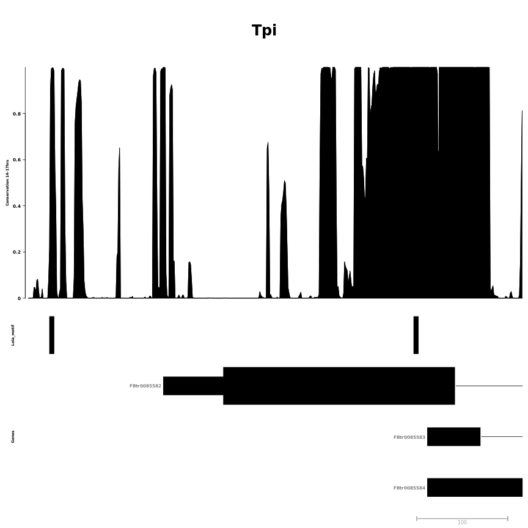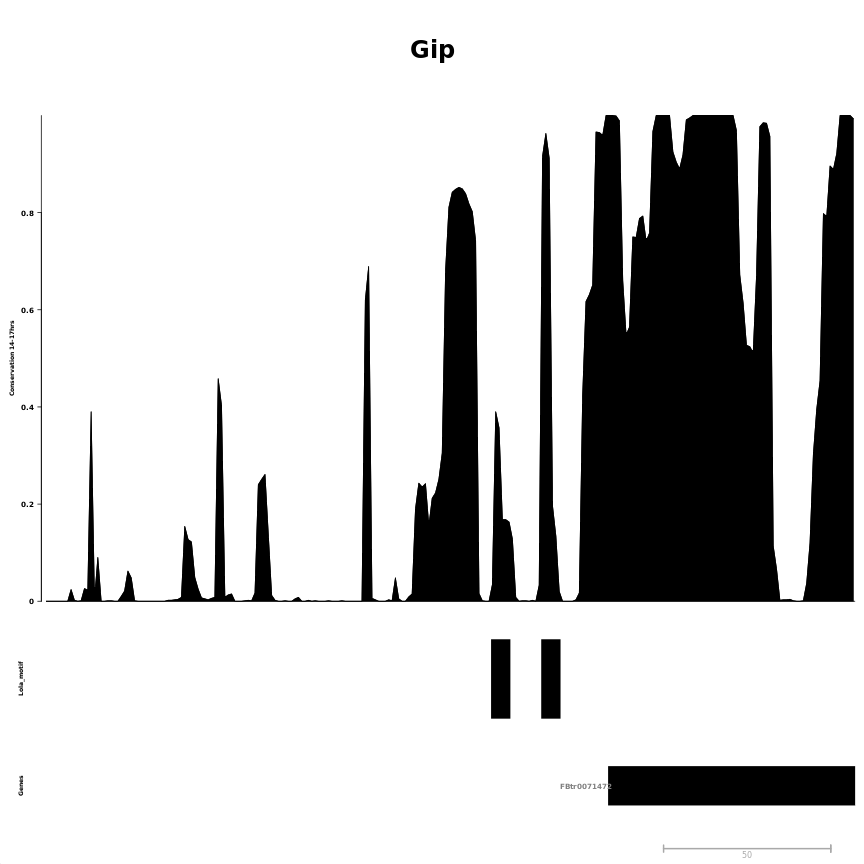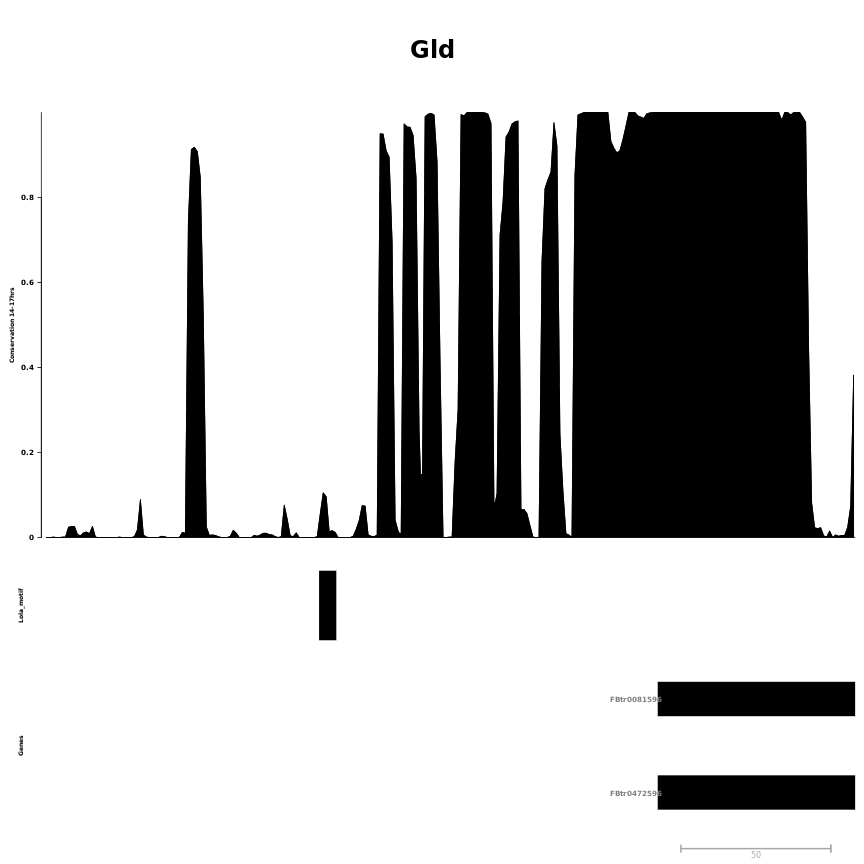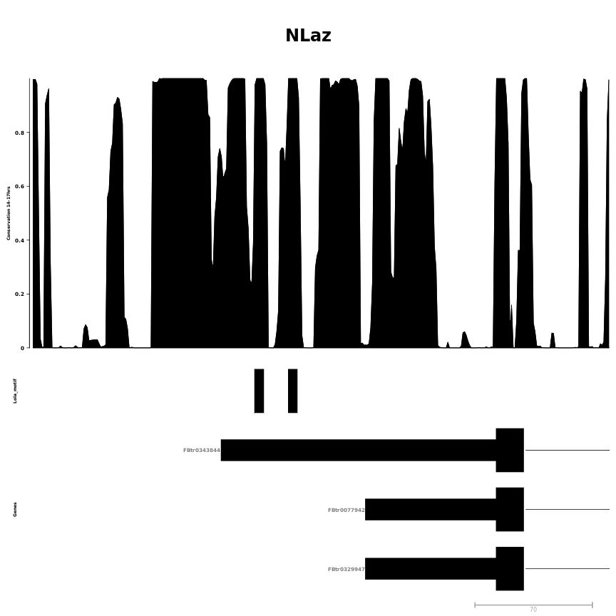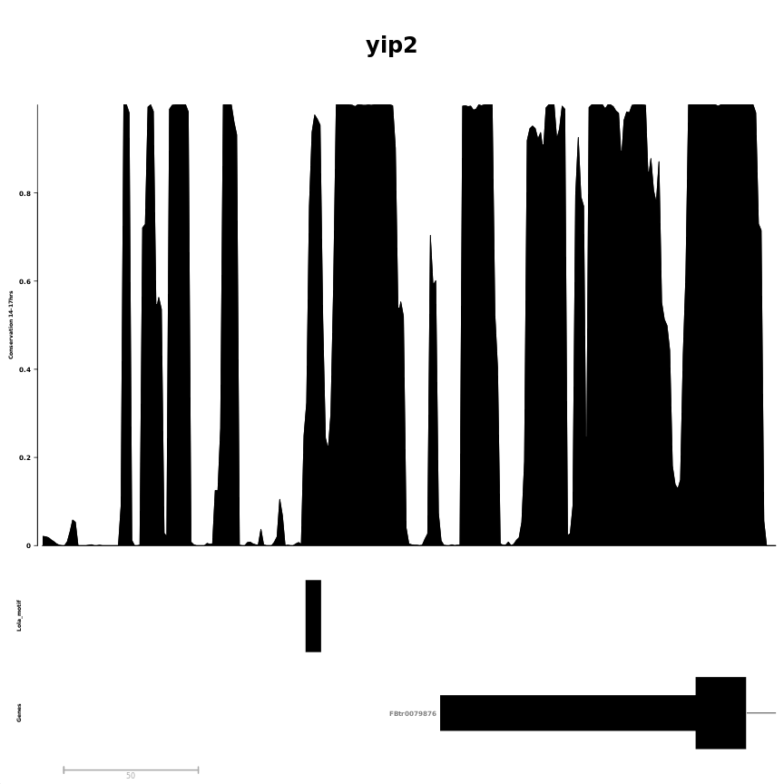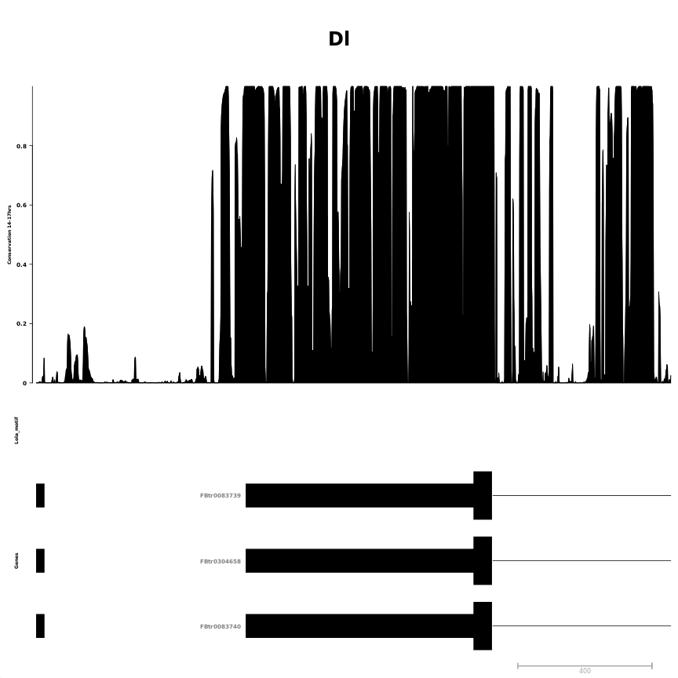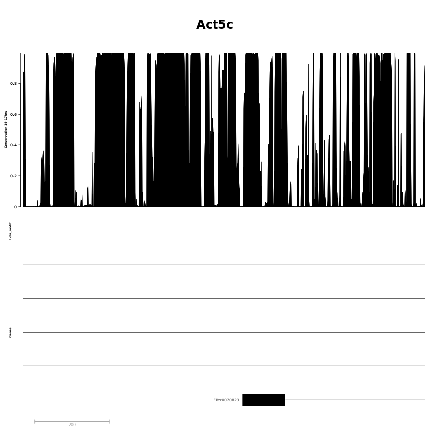

```
## [[1]]
## [[1]]$`Conservation 14-17hrs`
## ReferenceDataTrack 'Conservation 14-17hrs'
## | genome: dm6
## | active chromosome: chr3R
## | referenced file: ../external_data/conservation/dm6.phastCons124way.bw
## 
## [[1]]$Lola_motif
## AnnotationTrack 'Lola_motif'
## | genome: dm6
## | active chromosome: chr3R
## | annotation features: 2
## 
## [[1]]$Genes
## GeneRegionTrack 'Genes'
## | genome: dm6
## | active chromosome: chr3R
## | annotation features: 14
## 
## [[1]]$Axis
## Genome axis 'Axis'
## 
## [[1]]$titles
## An object of class "ImageMap"
## Slot "coords":
##                       x1       y1       x2       y2
## Conservation 14-17hrs  6  91.2000 43.14561 506.7867
## Lola_motif             6 506.7867 43.14561 589.9040
## Genes                  6 589.9040 43.14561 839.2560
## Axis                   6 839.2560 43.14561 858.0000
## 
## Slot "tags":
## $title
##   Conservation 14-17hrs              Lola_motif                   Genes 
## "Conservation 14-17hrs"            "Lola_motif"                 "Genes" 
##                    Axis 
##                  "Axis" 
## 
## 
## 
## 
## [[2]]
## [[2]]$`Conservation 14-17hrs`
## ReferenceDataTrack 'Conservation 14-17hrs'
## | genome: dm6
## | active chromosome: chrX
## | referenced file: ../external_data/conservation/dm6.phastCons124way.bw
## 
## [[2]]$Lola_motif
## AnnotationTrack 'Lola_motif'
## | genome: dm6
## | active chromosome: chrX
## | annotation features: 2
## 
## [[2]]$Genes
## GeneRegionTrack 'Genes'
## | genome: dm6
## | active chromosome: chrX
## | annotation features: 3
## 
## [[2]]$Axis
## Genome axis 'Axis'
## 
## [[2]]$titles
## An object of class "ImageMap"
## Slot "coords":
##                       x1       y1       x2       y2
## Conservation 14-17hrs  6  91.2000 43.14561 625.5257
## Lola_motif             6 625.5257 43.14561 732.3909
## Genes                  6 732.3909 43.14561 839.2560
## Axis                   6 839.2560 43.14561 858.0000
## 
## Slot "tags":
## $title
##   Conservation 14-17hrs              Lola_motif                   Genes 
## "Conservation 14-17hrs"            "Lola_motif"                 "Genes" 
##                    Axis 
##                  "Axis" 
## 
## 
## 
## 
## [[3]]
## [[3]]$`Conservation 14-17hrs`
## ReferenceDataTrack 'Conservation 14-17hrs'
## | genome: dm6
## | active chromosome: chr3R
## | referenced file: ../external_data/conservation/dm6.phastCons124way.bw
## 
## [[3]]$Lola_motif
## AnnotationTrack 'Lola_motif'
## | genome: dm6
## | active chromosome: chr3R
## | annotation features: 1
## 
## [[3]]$Genes
## GeneRegionTrack 'Genes'
## | genome: dm6
## | active chromosome: chr3R
## | annotation features: 12
## 
## [[3]]$Axis
## Genome axis 'Axis'
## 
## [[3]]$titles
## An object of class "ImageMap"
## Slot "coords":
##                       x1      y1       x2      y2
## Conservation 14-17hrs  6  91.200 43.14561 558.735
## Lola_motif             6 558.735 43.14561 652.242
## Genes                  6 652.242 43.14561 839.256
## Axis                   6 839.256 43.14561 858.000
## 
## Slot "tags":
## $title
##   Conservation 14-17hrs              Lola_motif                   Genes 
## "Conservation 14-17hrs"            "Lola_motif"                 "Genes" 
##                    Axis 
##                  "Axis" 
## 
## 
## 
## 
## [[4]]
## [[4]]$`Conservation 14-17hrs`
## ReferenceDataTrack 'Conservation 14-17hrs'
## | genome: dm6
## | active chromosome: chr2L
## | referenced file: ../external_data/conservation/dm6.phastCons124way.bw
## 
## [[4]]$Lola_motif
## AnnotationTrack 'Lola_motif'
## | genome: dm6
## | active chromosome: chr2L
## | annotation features: 2
## 
## [[4]]$Genes
## GeneRegionTrack 'Genes'
## | genome: dm6
## | active chromosome: chr2L
## | annotation features: 24
## 
## [[4]]$Axis
## Genome axis 'Axis'
## 
## [[4]]$titles
## An object of class "ImageMap"
## Slot "coords":
##                       x1       y1       x2       y2
## Conservation 14-17hrs  6  91.2000 43.14561 506.7867
## Lola_motif             6 506.7867 43.14561 589.9040
## Genes                  6 589.9040 43.14561 839.2560
## Axis                   6 839.2560 43.14561 858.0000
## 
## Slot "tags":
## $title
##   Conservation 14-17hrs              Lola_motif                   Genes 
## "Conservation 14-17hrs"            "Lola_motif"                 "Genes" 
##                    Axis 
##                  "Axis" 
## 
## 
## 
## 
## [[5]]
## [[5]]$`Conservation 14-17hrs`
## ReferenceDataTrack 'Conservation 14-17hrs'
## | genome: dm6
## | active chromosome: chr2L
## | referenced file: ../external_data/conservation/dm6.phastCons124way.bw
## 
## [[5]]$Lola_motif
## AnnotationTrack 'Lola_motif'
## | genome: dm6
## | active chromosome: chr2L
## | annotation features: 1
## 
## [[5]]$Genes
## GeneRegionTrack 'Genes'
## | genome: dm6
## | active chromosome: chr2L
## | annotation features: 6
## 
## [[5]]$Axis
## Genome axis 'Axis'
## 
## [[5]]$titles
## An object of class "ImageMap"
## Slot "coords":
##                       x1       y1       x2       y2
## Conservation 14-17hrs  6  91.2000 43.14561 625.5257
## Lola_motif             6 625.5257 43.14561 732.3909
## Genes                  6 732.3909 43.14561 839.2560
## Axis                   6 839.2560 43.14561 858.0000
## 
## Slot "tags":
## $title
##   Conservation 14-17hrs              Lola_motif                   Genes 
## "Conservation 14-17hrs"            "Lola_motif"                 "Genes" 
##                    Axis 
##                  "Axis" 
## 
## 
## 
## 
## [[6]]
## [[6]]$`Conservation 14-17hrs`
## ReferenceDataTrack 'Conservation 14-17hrs'
## | genome: dm6
## | active chromosome: chr3R
## | referenced file: ../external_data/conservation/dm6.phastCons124way.bw
## 
## [[6]]$Lola_motif
## AnnotationTrack 'Lola_motif'
## | genome: dm6
## | active chromosome: chr3R
## | annotation features: 0
## 
## [[6]]$Genes
## GeneRegionTrack 'Genes'
## | genome: dm6
## | active chromosome: chr3R
## | annotation features: 33
## 
## [[6]]$Axis
## Genome axis 'Axis'
## 
## [[6]]$titles
## An object of class "ImageMap"
## Slot "coords":
##                       x1       y1       x2       y2
## Conservation 14-17hrs  6  91.2000 43.14561 506.7867
## Lola_motif             6 506.7867 43.14561 589.9040
## Genes                  6 589.9040 43.14561 839.2560
## Axis                   6 839.2560 43.14561 858.0000
## 
## Slot "tags":
## $title
##   Conservation 14-17hrs              Lola_motif                   Genes 
## "Conservation 14-17hrs"            "Lola_motif"                 "Genes" 
##                    Axis 
##                  "Axis" 
## 
## 
## 
## 
## [[7]]
## [[7]]$`Conservation 14-17hrs`
## ReferenceDataTrack 'Conservation 14-17hrs'
## | genome: dm6
## | active chromosome: chrX
## | referenced file: ../external_data/conservation/dm6.phastCons124way.bw
## 
## [[7]]$Lola_motif
## AnnotationTrack 'Lola_motif'
## | genome: dm6
## | active chromosome: chrX
## | annotation features: 0
## 
## [[7]]$Genes
## GeneRegionTrack 'Genes'
## | genome: dm6
## | active chromosome: chrX
## | annotation features: 20
## 
## [[7]]$Axis
## Genome axis 'Axis'
## 
## [[7]]$titles
## An object of class "ImageMap"
## Slot "coords":
##                       x1       y1       x2       y2
## Conservation 14-17hrs  6  91.2000 43.14561 431.2255
## Lola_motif             6 431.2255 43.14561 499.2305
## Genes                  6 499.2305 43.14561 839.2560
## Axis                   6 839.2560 43.14561 858.0000
## 
## Slot "tags":
## $title
##   Conservation 14-17hrs              Lola_motif                   Genes 
## "Conservation 14-17hrs"            "Lola_motif"                 "Genes" 
##                    Axis 
##                  "Axis"
```


## Session information

For reproducibility, this analysis was performed with the following R/Bioconductor session:


```
R version 3.6.1 (2019-07-05)
Platform: x86_64-pc-linux-gnu (64-bit)
Running under: Ubuntu 18.04.2 LTS

Matrix products: default
BLAS:   /usr/lib/x86_64-linux-gnu/blas/libblas.so.3.7.1
LAPACK: /usr/lib/x86_64-linux-gnu/lapack/liblapack.so.3.7.1

locale:
 [1] LC_CTYPE=C.UTF-8       LC_NUMERIC=C           LC_TIME=C.UTF-8       
 [4] LC_COLLATE=C.UTF-8     LC_MONETARY=C.UTF-8    LC_MESSAGES=C.UTF-8   
 [7] LC_PAPER=C.UTF-8       LC_NAME=C              LC_ADDRESS=C          
[10] LC_TELEPHONE=C         LC_MEASUREMENT=C.UTF-8 LC_IDENTIFICATION=C   

attached base packages:
 [1] grid      stats4    parallel  stats     graphics  grDevices utils    
 [8] datasets  methods   base     

other attached packages:
 [1] pander_0.6.3                             
 [2] Gviz_1.28.1                              
 [3] dplyr_0.8.3                              
 [4] magrittr_1.5                             
 [5] BSgenome.Dmelanogaster.UCSC.dm6_1.4.1    
 [6] BSgenome_1.52.0                          
 [7] rtracklayer_1.44.4                       
 [8] Biostrings_2.52.0                        
 [9] XVector_0.24.0                           
[10] TxDb.Dmelanogaster.UCSC.dm6.ensGene_3.4.6
[11] GenomicFeatures_1.36.4                   
[12] AnnotationDbi_1.46.1                     
[13] Biobase_2.44.0                           
[14] GenomicRanges_1.36.1                     
[15] GenomeInfoDb_1.20.0                      
[16] IRanges_2.18.2                           
[17] S4Vectors_0.22.1                         
[18] BiocGenerics_0.30.0                      
[19] knitr_1.24                               

loaded via a namespace (and not attached):
 [1] ProtGenerics_1.16.0         bitops_1.0-6               
 [3] matrixStats_0.55.0          bit64_0.9-7                
 [5] RColorBrewer_1.1-2          progress_1.2.2             
 [7] httr_1.4.1                  tools_3.6.1                
 [9] backports_1.1.4             R6_2.4.0                   
[11] rpart_4.1-15                Hmisc_4.2-0                
[13] DBI_1.0.0                   lazyeval_0.2.2             
[15] colorspace_1.4-1            nnet_7.3-12                
[17] tidyselect_0.2.5            gridExtra_2.3              
[19] prettyunits_1.0.2           curl_4.0                   
[21] bit_1.1-14                  compiler_3.6.1             
[23] htmlTable_1.13.1            DelayedArray_0.10.0        
[25] scales_1.0.0                checkmate_1.9.4            
[27] stringr_1.4.0               digest_0.6.20              
[29] Rsamtools_2.0.0             foreign_0.8-72             
[31] base64enc_0.1-3             dichromat_2.0-0            
[33] pkgconfig_2.0.2             htmltools_0.3.6            
[35] highr_0.8                   ensembldb_2.8.0            
[37] htmlwidgets_1.3             rlang_0.4.0                
[39] rstudioapi_0.10             RSQLite_2.1.2              
[41] BiocParallel_1.18.1         acepack_1.4.1              
[43] VariantAnnotation_1.30.1    RCurl_1.95-4.12            
[45] GenomeInfoDbData_1.2.1      Formula_1.2-3              
[47] Matrix_1.2-17               Rcpp_1.0.2                 
[49] munsell_0.5.0               stringi_1.4.3              
[51] SummarizedExperiment_1.14.1 zlibbioc_1.30.0            
[53] blob_1.2.0                  crayon_1.3.4               
[55] lattice_0.20-38             splines_3.6.1              
[57] hms_0.5.1                   zeallot_0.1.0              
[59] pillar_1.4.2                biomaRt_2.40.4             
[61] XML_3.98-1.20               glue_1.3.1                 
[63] evaluate_0.14               biovizBase_1.32.0          
[65] latticeExtra_0.6-28         data.table_1.12.2          
[67] vctrs_0.2.0                 gtable_0.3.0               
[69] purrr_0.3.2                 assertthat_0.2.1           
[71] ggplot2_3.2.1               xfun_0.9                   
[73] AnnotationFilter_1.8.0      survival_2.44-1.1          
[75] tibble_2.1.3                GenomicAlignments_1.20.1   
[77] memoise_1.1.0               cluster_2.1.0              
```
